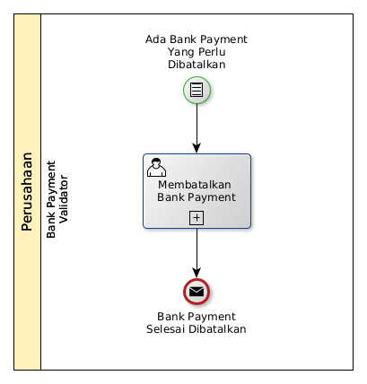

# Membatalkan Bank Payment

## <a name="input">A. START</a>

* Condition: Ada bank payment yang perlu dibatalkan.

## <a name="role">B. ROLE YANG TERLIBAT</a>

* Bank Payment Validator

## <a name="instruksi">C. INSTRUKSI KERJA</a>

### C.1 Membatalkan Bank Payment

#### C.1.1 Instruksi Kerja Utama

[Odoo - Bank Payment: 3.3.4.14](../transaksi/bank-payment/batal.md)

## <a name="input">D. END</a>

*Message*: Bank Payment selesai dibatalkan
