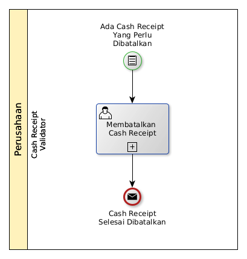

# Membatalkan Cash Receipt

## <a name="input">A. START</a>

* Condition: Ada cash receipt yang perlu dibatalkan.

## <a name="role">B. ROLE YANG TERLIBAT</a>

* Cash Receipt Validator

## <a name="instruksi">C. INSTRUKSI KERJA</a>

### C.1 Membatalkan Cash Receipt

#### C.1.1 Instruksi Kerja Utama

[Odoo - Cash Receipt: 3.3.5.14](../transaksi/cash-receipt/batal.md)

## <a name="input">D. END</a>

*Message*: Cash Receipt selesai dibatalkan
