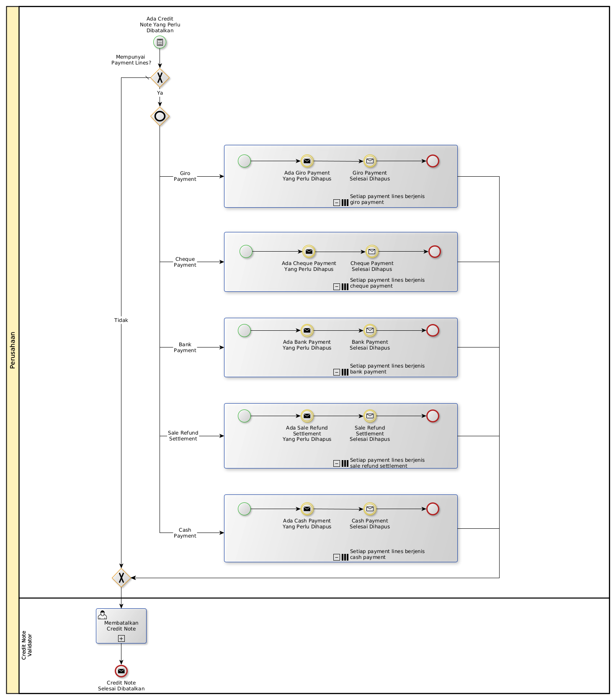

# Membatalkan Nota Kredit

## <a name="input">A. INPUT</a>

*Condition*: Ada credit note yang perlu dibatalkan.

## <a name="role">B. ROLE YANG TERLIBAT</a>

* Credit Note User

## <a name="instruksi">C. INSTRUKSI KERJA</a>

### C.1. Membatalkan Credit Note

#### C.1.1 Instruksi Kerja Utama

[Odoo - Credit Note: 3.1.2.11](../transaksi/credit-note/batal.md)

## <a name="input">D. END</a>

*Message*: Credit Note selesai dibatalkan
