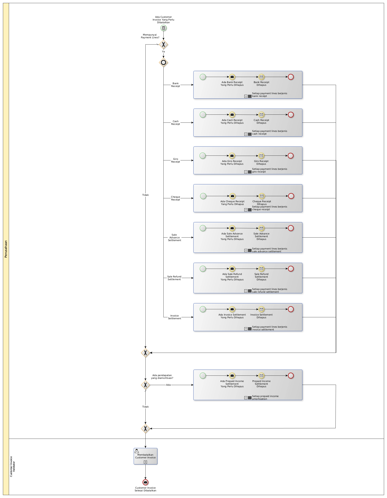

# Membatalkan Customer Invoice

## <a name="input">A. INPUT</a>

*Condition*: Ada customer invoice yang perlu dibatalkan.

## <a name="role">B. ROLE YANG TERLIBAT</a>

* Customer Invoice Validator

## <a name="instruksi">C. INSTRUKSI KERJA</a>

### C.1. Membatalkan Customer Invoice

#### C.1.1 Instruksi Kerja Utama

[Odoo - Customer Invoice: 3.1.1.11](../transaksi/customer-invoice/batal.md)

## <a name="input">D. END</a>

*Message*: Customer Invoice selesai dibatalkan
