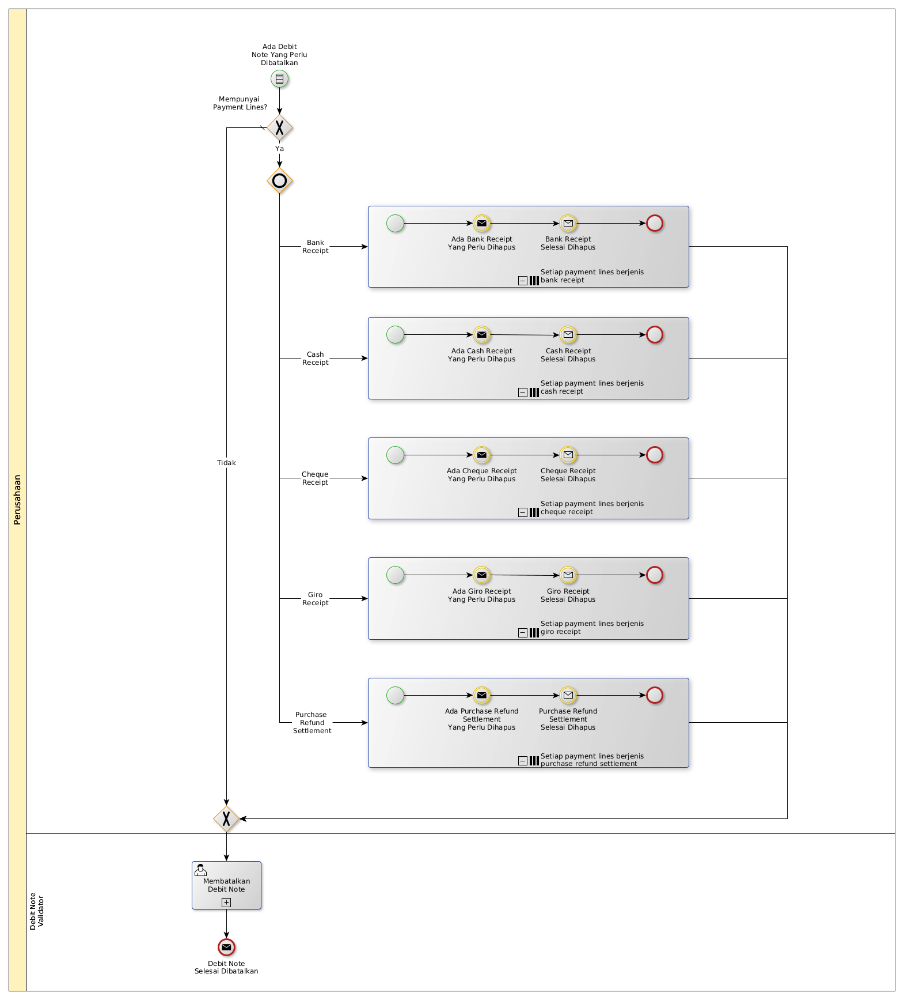

# Membatalkan Nota Debit

## <a name="input">A. INPUT</a>

*Condition*: Ada debit note yang perlu dibatalkan

## <a name="role">B. ROLE YANG TERLIBAT</a>

* Debit Note User

## <a name="instruksi">C. INSTRUKSI KERJA</a>

### C.1. Membatalkan Debit Note

#### C.1.1 Instruksi Kerja Utama

[Odoo - Debit Note: 3.2.2.11](../transaksi/debit-note/batal.md)

## <a name="input">D. END</a>

*Message*: Debit Note selesai dibatalkan.
