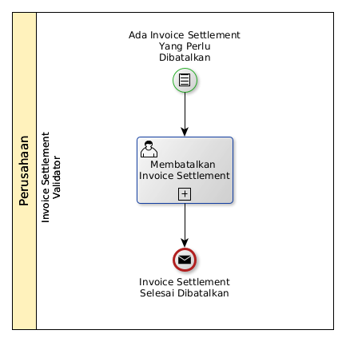

# Membatalkan Invoice Settlement

## <a name="input">A. START</a>

* Condition: Ada invoice settlement yang perlu dibatalkan.

## <a name="role">B. ROLE YANG TERLIBAT</a>

* Invoice Settlement Validator

## <a name="instruksi">C. INSTRUKSI KERJA</a>

### C.1 Membatalkan Invoice Settlement

#### C.1.1 Instruksi Kerja Utama

[Odoo - Invoice Settlement: 3.1.5.17](../transaksi/invoice-settlement/batal.md)

## <a name="input">D. END</a>

*Message*: Invoice Settlement selesai dibatalkan
