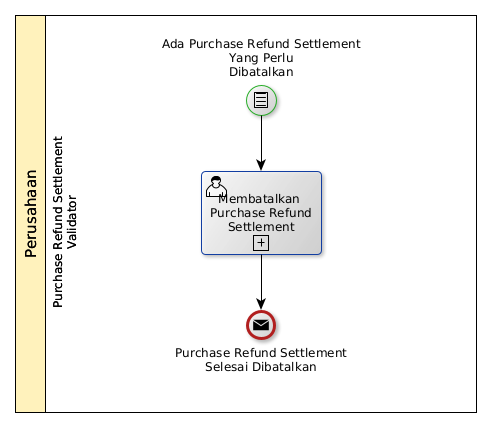

# Membatalkan Purchase Refund Settlement

## <a name="input">A. START</a>

* Condition: Ada purchase refund settlement yang perlu dibatalkan.

## <a name="role">B. ROLE YANG TERLIBAT</a>

* Purchase Refund Settlement Validator

## <a name="instruksi">C. INSTRUKSI KERJA</a>

### C.1 Membatalkan Purchase Refund Settlement

#### C.1.1 Instruksi Kerja Utama

[Odoo - Purchase Refund Settlement: 3.2.4.16](../transaksi/purchase-refund-settlement/batal.md)

## <a name="input">D. END</a>

*Message*: Purchase Refund Settlement selesai dibatalkan
