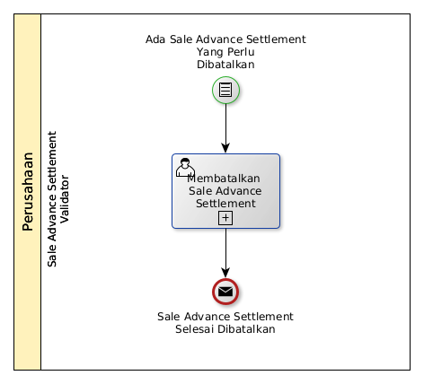

# Membatalkan Sale Advance Settlement

## <a name="input">A. START</a>

* Condition: Ada sale advance settlement yang perlu dibatalkan.

## <a name="role">B. ROLE YANG TERLIBAT</a>

* Sale Advance Settlement Validator

## <a name="instruksi">C. INSTRUKSI KERJA</a>

### C.1 Membatalkan Sale Advance Settlement

#### C.1.1 Instruksi Kerja Utama

[Odoo - Sale Advance Settlement: 3.1.3.16](../transaksi/sale-advance-settlement/batal.md)

## <a name="input">D. END</a>

*Message*: Sale Advance Settlement selesai dibatalkan
