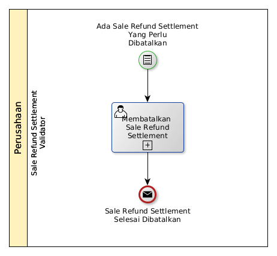

# Membatalkan Sale Refund Settlement

## <a name="input">A. START</a>

* Condition: Ada sale refund settlement yang perlu dibatalkan.

## <a name="role">B. ROLE YANG TERLIBAT</a>

* Sale Refund Settlement Validator

## <a name="instruksi">C. INSTRUKSI KERJA</a>

### C.1 Membatalkan Sale Refund Settlement

#### C.1.1 Instruksi Kerja Utama

[Odoo - Sale Refund Settlement: 3.1.4.16](../transaksi/sale-refund-settlement/batal.md)

## <a name="input">D. END</a>

*Message*: Sale Refund Settlement selesai dibatalkan
