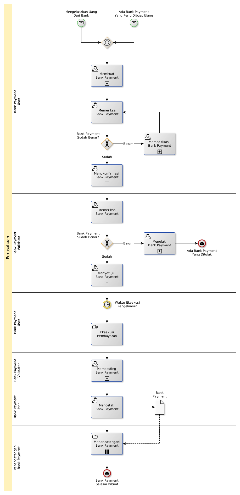

# Membuat Bank Payment

## <a name="input">A. START</a>

* *Message*: Ada bank payment yang perlu dibuat ulang, atau
* *Message*: Mengeluarkan uang dari bank

## <a name="role">B. ROLE YANG TERLIBAT</a>

* Bank Payment User
* Bank Payment Validator
* Penandatangan Bank Payment

## <a name="instruksi">C. INSTRUKSI KERJA</a>

### C.1 Membuat Bank Payment

#### C.1.1 Instruksi Kerja Utama

[Odoo - Bank Payment: 3.3.4.2](../transaksi/bank-payment/membuat.md)

#### C.1.2 Sub Instruksi Kerja

* [Odoo - Bank Payment: 3.3.4.6](../transaksi/bank-payment/membuat-detail-manual.md)
* [Odoo - Bank Payment: 3.3.4.7](../transaksi/bank-payment/line-modifikasi.md)
* [Odoo - Bank Payment: 3.3.4.8](../transaksi/bank-payment/line-hapus.md)

### C.2 Mengkonfirmasi Bank Payment

#### C.2.1 Instruksi Kerja Utama

[Odoo - Bank Payment: 3.3.4.9](../transaksi/bank-payment/konfirmasi.md)

### C.3 Menyetujui Bank Payment

#### C.3.1 Instruksi Kerja Utama

[Odoo - Bank Payment: 3.3.4.10](../transaksi/bank-payment/approve.md)

### C.4 Memposting Bank Payment

#### C.4.1 Instruksi Kerja Utama

[Odoo - Bank Payment: 3.3.4.13](../transaksi/bank-payment/post.md)

## <a name="input">D. END</a>

*Message*: Bank Payment selesai dibuat
