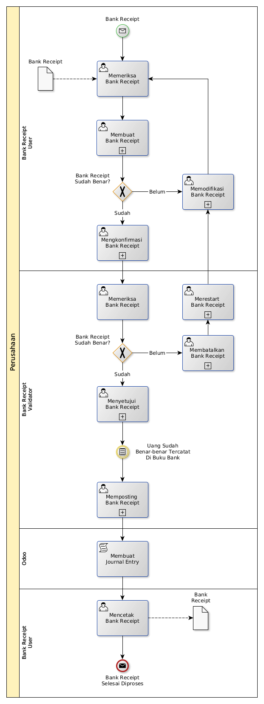

# Membuat Bank Receipt

## <a name="input">A. START</a>

* *Message*: Ada bank receipt yang perlu dibuat ulang, atau
* *Message*: Menerima uang di bank

## <a name="role">B. ROLE YANG TERLIBAT</a>

* Bank Receipt User
* Bank Receipt Validator
* Penandatangan Bank Receipt

## <a name="instruksi">C. INSTRUKSI KERJA</a>

### C.1 Membuat Bank Receipt

#### C.1.1 Instruksi Kerja Utama

[Odoo - Bank Receipt: 3.3.3.2](../transaksi/bank-receipt/membuat.md)

#### C.1.2 Sub Instruksi Kerja

* [Odoo - Bank Receipt: 3.3.3.6](../transaksi/bank-receipt/membuat-detail-manual.md)
* [Odoo - Bank Receipt: 3.3.3.7](../transaksi/bank-receipt/line-modifikasi.md)
* [Odoo - Bank Receipt: 3.3.3.8](../transaksi/bank-receipt/line-hapus.md)

### C.2 Mengkonfirmasi Bank Receipt

#### C.2.1 Instruksi Kerja Utama

[Odoo - Bank Receipt: 3.3.3.9](../transaksi/bank-receipt/konfirmasi.md)

### C.3 Menyetujui Bank Receipt

#### C.3.1 Instruksi Kerja Utama

[Odoo - Bank Receipt: 3.3.3.10](../transaksi/bank-receipt/approve.md)

### C.4 Memposting Bank Receipt

#### C.4.1 Instruksi Kerja Utama

[Odoo - Bank Receipt: 3.3.3.13](../transaksi/bank-receipt/post.md)

## <a name="input">D. END</a>

*Message*: Bank Receipt selesai dibuat
