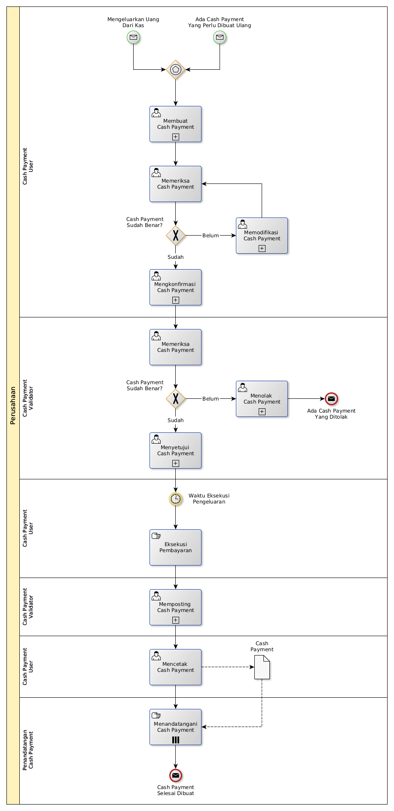

# Membuat Cash Payment

## <a name="input">A. START</a>

* *Message*: Ada cash payment yang perlu dibuat ulang, atau
* *Message*: Mengeluarkan uang dari kas

## <a name="role">B. ROLE YANG TERLIBAT</a>

* Cash Payment User
* Cash Payment Validator
* Penandatangan Cash Payment

## <a name="instruksi">C. INSTRUKSI KERJA</a>

### C.1 Membuat Cash Payment

#### C.1.1 Instruksi Kerja Utama

[Odoo - Cash Payment: 3.3.6.2](../transaksi/cash-payment/membuat.md)

#### C.1.2 Sub Instruksi Kerja

* [Odoo - Cash Payment: 3.3.6.6](../transaksi/cash-payment/membuat-detail-manual.md)
* [Odoo - Cash Payment: 3.3.6.7](../transaksi/cash-payment/line-modifikasi.md)
* [Odoo - Cash Payment: 3.3.6.8](../transaksi/cash-payment/line-hapus.md)

### C.2 Mengkonfirmasi Cash Payment

#### C.2.1 Instruksi Kerja Utama

[Odoo - Cash Payment: 3.3.6.9](../transaksi/cash-payment/konfirmasi.md)

### C.3 Menyetujui Cash Payment

#### C.3.1 Instruksi Kerja Utama

[Odoo - Cash Payment: 3.3.6.10](../transaksi/cash-payment/approve.md)

### C.4 Memposting Cash Payment

#### C.4.1 Instruksi Kerja Utama

[Odoo - Cash Payment: 3.3.6.13](../transaksi/cash-payment/post.md)

## <a name="input">D. END</a>

*Message*: Cash Payment selesai dibuat
