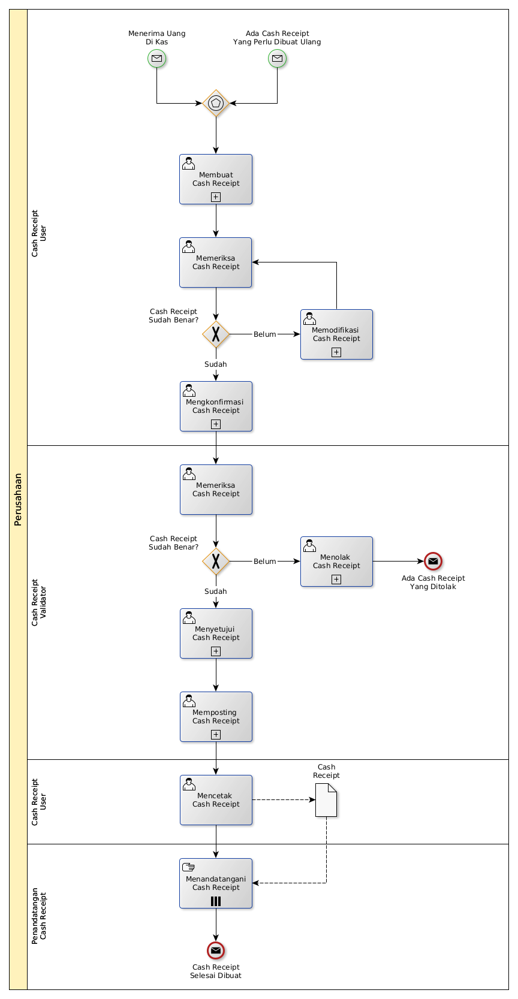

# Membuat Cash Receipt

## <a name="input">A. START</a>

* *Message*: Ada cash receipt yang perlu dibuat ulang, atau
* *Message*: Menerima uang di kas

## <a name="role">B. ROLE YANG TERLIBAT</a>

* Cash Receipt User
* Cash Receipt Validator
* Penandatangan Cash Receipt

## <a name="instruksi">C. INSTRUKSI KERJA</a>

### C.1 Membuat Cash Receipt

#### C.1.1 Instruksi Kerja Utama

[Odoo - Cash Receipt: 3.3.5.2](../transaksi/cash-receipt/membuat.md)

#### C.1.2 Sub Instruksi Kerja

* [Odoo - Cash Receipt: 3.3.5.6](../transaksi/cash-receipt/membuat-detail-manual.md)
* [Odoo - Cash Receipt: 3.3.5.7](../transaksi/cash-receipt/line-modifikasi.md)
* [Odoo - Cash Receipt: 3.3.5.8](../transaksi/cash-receipt/line-hapus.md)

### C.2 Mengkonfirmasi Cash Receipt

#### C.2.1 Instruksi Kerja Utama

[Odoo - Cash Receipt: 3.3.5.9](../transaksi/cash-receipt/konfirmasi.md)

### C.3 Menyetujui Bank Receipt

#### C.3.1 Instruksi Kerja Utama

[Odoo - Cash Receipt: 3.3.5.10](../transaksi/cash-receipt/approve.md)

### C.4 Memposting Cash Receipt

#### C.4.1 Instruksi Kerja Utama

[Odoo - Cash Receipt: 3.3.5.13](../transaksi/cash-receipt/post.md)

## <a name="input">D. END</a>

*Message*: Cash Receipt selesai dibuat
