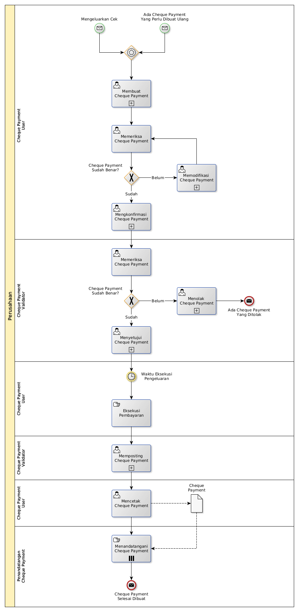

# Membuat Cheque Payment

## <a name="input">A. START</a>

* *Message*: Ada cheque payment yang perlu dibuat ulang, atau
* *Message*: Mengeluarkan Cek

## <a name="role">B. ROLE YANG TERLIBAT</a>

* Cheque Payment User
* Cheque Payment Validator
* Penandatangan Cheque Payment

## <a name="instruksi">C. INSTRUKSI KERJA</a>

### C.1 Membuat Cheque Payment

#### C.1.1 Instruksi Kerja Utama

[Odoo - Cheque Payment: 3.3.10.2](../transaksi/cheque-payment/membuat.md)

#### C.1.2 Sub Instruksi Kerja

* [Odoo - Cheque Payment: 3.3.10.6](../transaksi/cheque-payment/membuat-detail-manual.md)
* [Odoo - Cheque Payment: 3.3.10.7](../transaksi/cheque-payment/line-modifikasi.md)
* [Odoo - Cheque Payment: 3.3.10.8](../transaksi/cheque-payment/line-hapus.md)

### C.2 Mengkonfirmasi Cheque Payment

#### C.2.1 Instruksi Kerja Utama

[Odoo - Cheque Payment: 3.3.10.9](../transaksi/cheque-payment/konfirmasi.md)

### C.3 Menyetujui Cheque Payment

#### C.3.1 Instruksi Kerja Utama

[Odoo - Cheque Payment: 3.3.10.10](../transaksi/cheque-payment/approve.md)

### C.4 Memposting Cheque Payment

#### C.4.1 Instruksi Kerja Utama

[Odoo - Cheque Payment: 3.3.10.13](../transaksi/cheque-payment/post.md)

## <a name="input">D. END</a>

*Message*: Cheque Payment selesai dibuat
