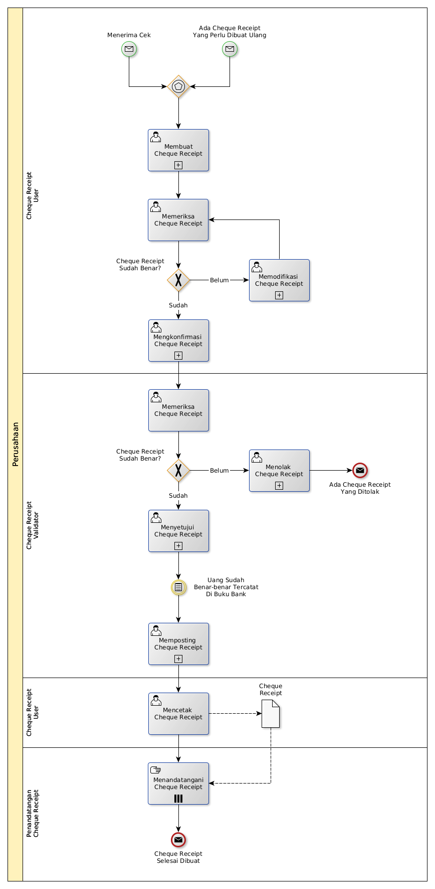

# Membuat Cheque Receipt

## <a name="input">A. START</a>

* *Message*: Ada cheque receipt yang perlu dibuat ulang, atau
* *Message*: Menerima cheque di bank

## <a name="role">B. ROLE YANG TERLIBAT</a>

* Cheque Receipt User
* Cheque Receipt Validator
* Penandatangan Cheque Receipt

## <a name="instruksi">C. INSTRUKSI KERJA</a>

### C.1 Membuat Cheque Receipt

#### C.1.1 Instruksi Kerja Utama

[Odoo - Cheque Receipt: 3.3.9.2](../transaksi/cheque-receipt/membuat.md)

#### C.1.2 Sub Instruksi Kerja

* [Odoo - Cheque Receipt: 3.3.9.6](../transaksi/cheque-receipt/membuat-detail-manual.md)
* [Odoo - Cheque Receipt: 3.3.9.7](../transaksi/cheque-receipt/line-modifikasi.md)
* [Odoo - Cheque Receipt: 3.3.9.8](../transaksi/cheque-receipt/line-hapus.md)

### C.2 Mengkonfirmasi Cheque Receipt

#### C.2.1 Instruksi Kerja Utama

[Odoo - Cheque Receipt: 3.3.9.9](../transaksi/cheque-receipt/konfirmasi.md)

### C.3 Menyetujui Cheque Receipt

#### C.3.1 Instruksi Kerja Utama

[Odoo - Cheque Receipt: 3.3.9.10](../transaksi/cheque-receipt/approve.md)

### C.4 Memposting Cheque Receipt

#### C.4.1 Instruksi Kerja Utama

[Odoo - Cheque Receipt: 3.3.9.13](../transaksi/cheque-receipt/post.md)

## <a name="input">D. END</a>

*Message*: Cheque Receipt selesai dibuat
