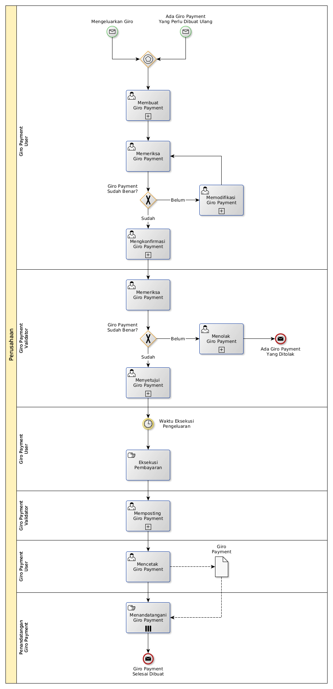

# Membuat Giro Payment

## <a name="input">A. START</a>

* *Message*: Ada giro payment yang perlu dibuat ulang, atau
* *Message*: Mengeluarkan Giro

## <a name="role">B. ROLE YANG TERLIBAT</a>

* Giro Payment User
* Giro Payment Validator
* Penandatangan Giro Payment

## <a name="instruksi">C. INSTRUKSI KERJA</a>

### C.1 Membuat Giro Payment

#### C.1.1 Instruksi Kerja Utama

[Odoo - Giro Payment: 3.3.8.2](../transaksi/giro-payment/membuat.md)

#### C.1.2 Sub Instruksi Kerja

* [Odoo - Giro Payment: 3.3.8.6](../transaksi/giro-payment/membuat-detail-manual.md)
* [Odoo - Giro Payment: 3.3.8.7](../transaksi/giro-payment/line-modifikasi.md)
* [Odoo - Giro Payment: 3.3.8.8](../transaksi/giro-payment/line-hapus.md)

### C.2 Mengkonfirmasi Giro Payment

#### C.2.1 Instruksi Kerja Utama

[Odoo - Giro Payment: 3.3.8.9](../transaksi/giro-payment/konfirmasi.md)

### C.3 Menyetujui Giro Payment

#### C.3.1 Instruksi Kerja Utama

[Odoo - Giro Payment: 3.3.8.10](../transaksi/giro-payment/approve.md)

### C.4 Memposting Giro Payment

#### C.4.1 Instruksi Kerja Utama

[Odoo - Giro Payment: 3.3.8.13](../transaksi/giro-payment/post.md)

## <a name="input">D. END</a>

*Message*: Giro Payment selesai dibuat
