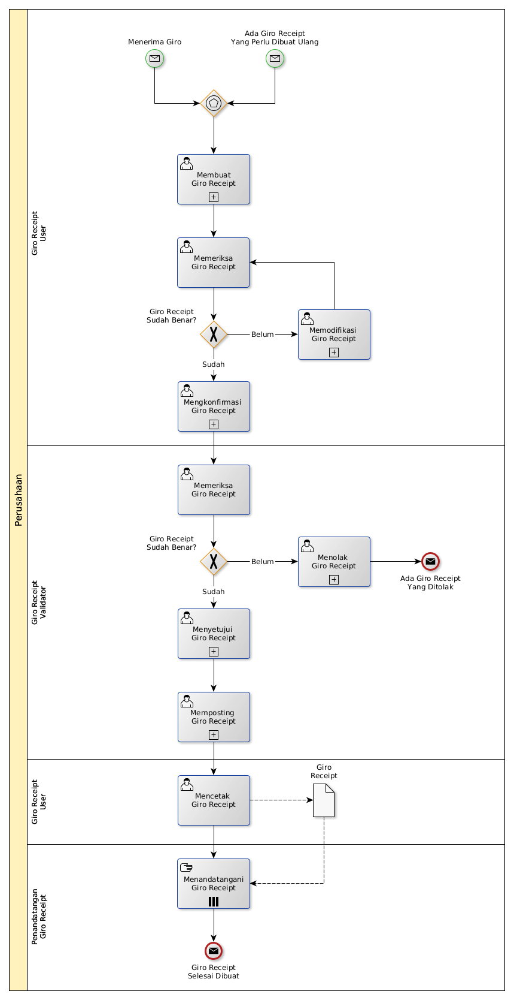

# Membuat Giro Receipt

## <a name="input">A. START</a>

* *Message*: Ada giro receipt yang perlu dibuat ulang, atau
* *Message*: Menerima Giro

## <a name="role">B. ROLE YANG TERLIBAT</a>

* Giro Receipt User
* Giro Receipt Validator
* Penandatangan Giro Receipt

## <a name="instruksi">C. INSTRUKSI KERJA</a>

### C.1 Membuat Giro Receipt

#### C.1.1 Instruksi Kerja Utama

[Odoo - Giro Receipt: 3.3.7.2](../transaksi/giro-receipt/membuat.md)

#### C.1.2 Sub Instruksi Kerja

* [Odoo - Giro Receipt: 3.3.7.6](../transaksi/giro-receipt/membuat-detail-manual.md)
* [Odoo - Giro Receipt: 3.3.7.7](../transaksi/giro-receipt/line-modifikasi.md)
* [Odoo - Giro Receipt: 3.3.7.8](../transaksi/giro-receipt/line-hapus.md)

### C.2 Mengkonfirmasi Giro Receipt

#### C.2.1 Instruksi Kerja Utama

[Odoo - Giro Receipt: 3.3.7.9](../transaksi/giro-receipt/konfirmasi.md)

### C.3 Menyetujui Giro Receipt

#### C.3.1 Instruksi Kerja Utama

[Odoo - Giro Receipt: 3.3.7.10](../transaksi/giro-receipt/approve.md)

### C.4 Memposting Giro Receipt

#### C.4.1 Instruksi Kerja Utama

[Odoo - Giro Receipt: 3.3.7.13](../transaksi/giro-receipt/post.md)

## <a name="input">D. END</a>

*Message*: Giro Receipt selesai dibuat
