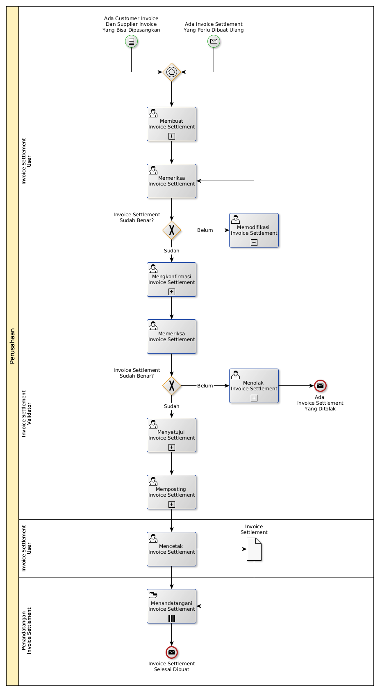

# Membuat Invoice Settlement

## <a name="input">A. START</a>

* *Message*: Ada invoice settlement yang perlu dibuat ulang, atau
* *Condition*: Ada customer invoice dan supplier invoice yang bisa dipasangkan

## <a name="role">B. ROLE YANG TERLIBAT</a>

* Invoice Settlement User
* Invoice Settlement Validator
* Penandatangan Invoice Settlement

## <a name="instruksi">C. INSTRUKSI KERJA</a>

### C.1 Membuat Invoice Settlement

#### C.1.1 Instruksi Kerja Utama

[Odoo - Invoice Settlement: 3.1.5.2](../transaksi/invoice-settlement/membuat.md)

#### C.1.2 Sub Instruksi Kerja

* [Odoo - Invoice Settlement: 3.1.5.5](../transaksi/invoice-settlement/import-debit-line.md)
* [Odoo - Invoice Settlement: 3.1.5.6](../transaksi/invoice-settlement/memodifikasi-debit-line.md)
* [Odoo - Invoice Settlement: 3.1.5.7](../transaksi/invoice-settlement/menghapus-debit-line.md)
* [Odoo - Invoice Settlement: 3.1.5.8](../transaksi/invoice-settlement/import-credit-line.md)
* [Odoo - Invoice Settlement: 3.1.5.9](../transaksi/invoice-settlement/memodifikasi-credit-line.md)
* [Odoo - Invoice Settlement: 3.1.5.10](../transaksi/invoice-settlement/menghapus-credit-line.md)

### C.2 Mengkonfirmasi Invoice Settlement

#### C.2.1 Instruksi Kerja Utama

[Odoo - Invoice Settlement: 3.1.5.11](../transaksi/invoice-settlement/konfirmasi.md)

### C.3 Menyetujui Invoice Settlement

#### C.3.1 Instruksi Kerja Utama

[Odoo - Invoice Settlement: 3.1.5.12](../transaksi/invoice-settlement/approve.md)

### C.4 Memposting Invoice Settlement

#### C.4.1 Instruksi Kerja Utama

[Odoo - Invoice Settlement: 3.1.5.16](../transaksi/invoice-settlement/post.md)

## <a name="input">D. END</a>

*Message*: Invoice Settlement selesai dibuat
