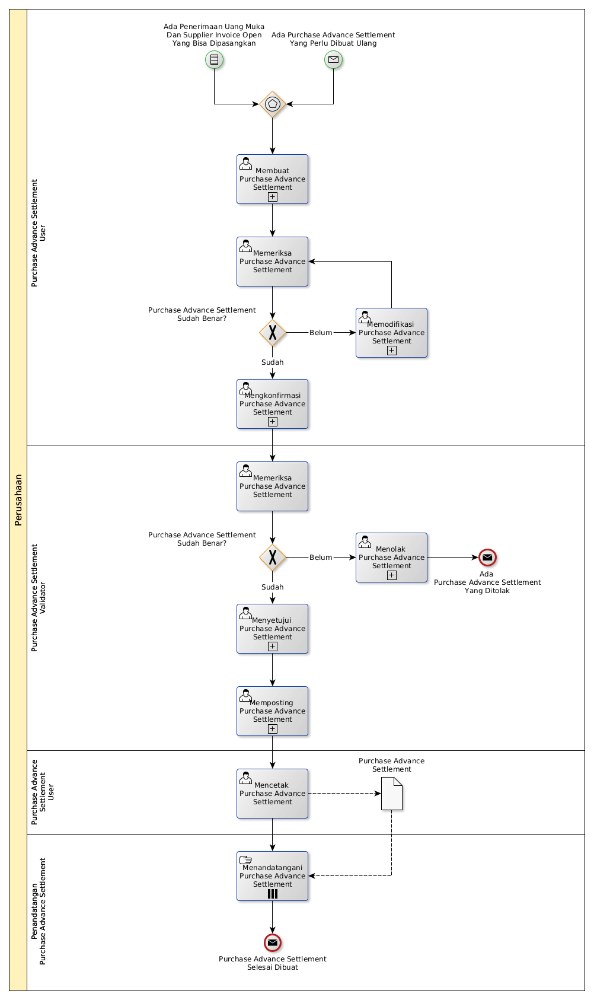

# Membuat Purchase Advance Settlement

## <a name="input">A. START</a>

* *Message*: Ada purchase advance settlement yang perlu dibuat ulang, atau
* *Condition*: Ada penerimaan uang muka dan supplier invoice open yang bisa dipasangkan

## <a name="role">B. ROLE YANG TERLIBAT</a>

* Purchase Advance Settlement User
* Purchase Advance Settlement Validator
* Penandatangan Purchase Advance Settlement

## <a name="instruksi">C. INSTRUKSI KERJA</a>

### C.1 Membuat Purchase Advance Settlement

#### C.1.1 Instruksi Kerja Utama

[Odoo - Purchase Advance Settlement: 3.2.3.2](../transaksi/purchase-advance-settlement/membuat.md)

#### C.1.2 Sub Instruksi Kerja

* [Odoo - Purchase Advance Settlement: 3.2.3.5](../transaksi/purchase-advance-settlement/import-debit-line.md)
* [Odoo - Purchase Advance Settlement: 3.2.3.6](../transaksi/purchase-advance-settlement/memodifikasi-debit-line.md)
* [Odoo - Purchase Advance Settlement: 3.2.3.7](../transaksi/purchase-advance-settlement/menghapus-debit-line.md)
* [Odoo - Purchase Advance Settlement: 3.2.3.8](../transaksi/purchase-advance-settlement/import-credit-line.md)
* [Odoo - Purchase Advance Settlement: 3.2.3.9](../transaksi/purchase-advance-settlement/memodifikasi-credit-line.md)
* [Odoo - Purchase Advance Settlement: 3.2.3.10](../transaksi/purchase-advance-settlement/menghapus-credit-line.md)

### C.2 Mengkonfirmasi Purchase Advance Settlement

#### C.2.1 Instruksi Kerja Utama

[Odoo - Purchase Advance Settlement: 3.2.3.11](../transaksi/purchase-advance-settlement/konfirmasi.md)

### C.3 Menyetujui Purchase Advance Settlement

#### C.3.1 Instruksi Kerja Utama

[Odoo - Purchase Advance Settlement: 3.2.3.12](../transaksi/purchase-advance-settlement/approve.md)

### C.4 Memposting Purchase Advance Settlement

#### C.4.1 Instruksi Kerja Utama

[Odoo - Purchase Advance Settlement: 3.2.3.15](../transaksi/purchase-advance-settlement/post.md)

## <a name="input">D. END</a>

*Message*: Purchase Advance Settlement selesai dibuat
