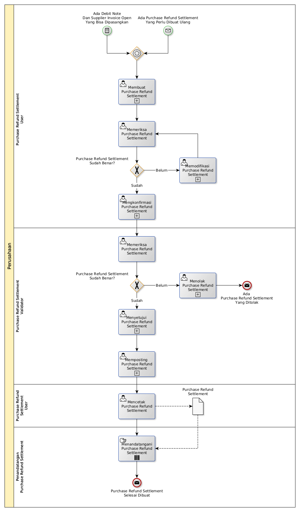

# Membuat Purchase Refund Settlement

## <a name="input">A. START</a>

* *Message*: Ada purchase refund settlement yang perlu dibuat ulang, atau
* *Condition*: Ada debit note dan supplier invoice open yang bisa dipasangkan

## <a name="role">B. ROLE YANG TERLIBAT</a>

* Purchase Refund Settlement User
* Purchase Refund Settlement Validator
* Penandatangan Purchase Refund Settlement

## <a name="instruksi">C. INSTRUKSI KERJA</a>

### C.1 Membuat Purchase Refund Settlement

#### C.1.1 Instruksi Kerja Utama

[Odoo - Purchase Refund Settlement: 3.2.4.2](../transaksi/purchase-refund-settlement/membuat.md)

#### C.1.2 Sub Instruksi Kerja

* [Odoo - Purchase Refund Settlement: 3.2.4.5](../transaksi/purchase-refund-settlement/import-debit-line.md)
* [Odoo - Purchase Refund Settlement: 3.2.4.6](../transaksi/purchase-refund-settlement/memodifikasi-debit-line.md)
* [Odoo - Purchase Refund Settlement: 3.2.4.7](../transaksi/purchase-refund-settlement/menghapus-debit-line.md)
* [Odoo - Purchase Refund Settlement: 3.2.4.8](../transaksi/purchase-refund-settlement/import-credit-line.md)
* [Odoo - Purchase Refund Settlement: 3.2.4.9](../transaksi/purchase-refund-settlement/memodifikasi-credit-line.md)
* [Odoo - Purchase Refund Settlement: 3.2.4.10](../transaksi/purchase-refund-settlement/menghapus-credit-line.md)

### C.2 Mengkonfirmasi Purchase Refund Settlement

#### C.2.1 Instruksi Kerja Utama

[Odoo - Purchase Refund Settlement: 3.2.4.11](../transaksi/purchase-refund-settlement/konfirmasi.md)

### C.3 Menyetujui Purchase Refund Settlement

#### C.3.1 Instruksi Kerja Utama

[Odoo - Purchase Refund Settlement: 3.2.4.12](../transaksi/purchase-refund-settlement/approve.md)

### C.4 Memposting Purchase Refund Settlement

#### C.4.1 Instruksi Kerja Utama

[Odoo - Purchase Refund Settlement: 3.2.4.15](../transaksi/purchase-refund-settlement/post.md)

## <a name="input">D. END</a>

*Message*: Purchase Refund Settlement selesai dibuat
