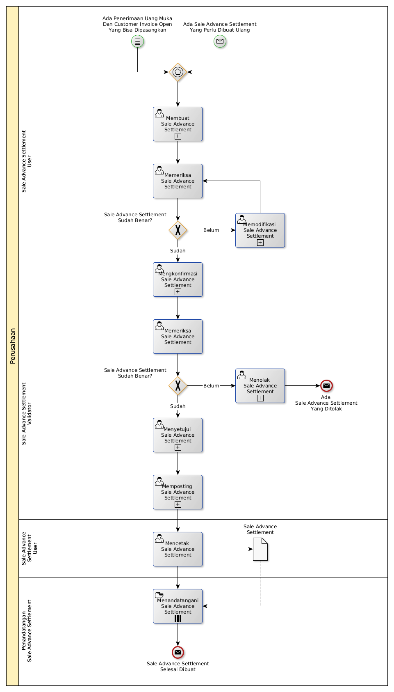

# Membuat Sale Advance Settlement

## <a name="input">A. START</a>

* *Message*: Ada sale advance settlement yang perlu dibuat ulang, atau
* *Condition*: Ada penerimaan uang muka dan customer invoice open yang bisa dipasangkan

## <a name="role">B. ROLE YANG TERLIBAT</a>

* Sale Advance Settlement User
* Sale Advance Settlement Validator
* Penandatangan Sale Advance Settlement

## <a name="instruksi">C. INSTRUKSI KERJA</a>

### C.1 Membuat Sale Advance Settlement

#### C.1.1 Instruksi Kerja Utama

[Odoo - Sale Advance Settlement: 3.1.3.2](../transaksi/sale-advance-settlement/membuat.md)

#### C.1.2 Sub Instruksi Kerja

* [Odoo - Sale Advance Settlement: 3.1.3.5](../transaksi/sale-advance-settlement/debit-line.md)
* [Odoo - Sale Advance Settlement: 3.1.3.6](../transaksi/sale-advance-settlement/memodifikasi-debit-line.md)
* [Odoo - Sale Advance Settlement: 3.1.3.7](../transaksi/sale-advance-settlement/menghapus-debit-line.md)
* [Odoo - Sale Advance Settlement: 3.1.3.8](../transaksi/sale-advance-settlement/credit-line-import.md)
* [Odoo - Sale Advance Settlement: 3.1.3.9](../transaksi/sale-advance-settlement/memodifikasi-credit-line.md)
* [Odoo - Sale Advance Settlement: 3.1.3.10](../transaksi/sale-advance-settlement/menghapus-credit-line.md)

### C.2 Mengkonfirmasi Sale Advance Settlement

#### C.2.1 Instruksi Kerja Utama

[Odoo - Sale Advance Settlement: 3.1.3.11](../transaksi/sale-advance-settlement/konfirmasi.md)

### C.3 Menyetujui Sale Advance Settlement

#### C.3.1 Instruksi Kerja Utama

[Odoo - Sale Advance Settlement: 3.1.3.12](../transaksi/sale-advance-settlement/approve.md)

### C.4 Memposting Sale Advance Settlement

#### C.4.1 Instruksi Kerja Utama

[Odoo - Sale Advance Settlement: 3.1.3.15](../transaksi/sale-advance-settlement/post.md)

## <a name="input">D. END</a>

*Message*: Sale Advance Settlement selesai dibuat
