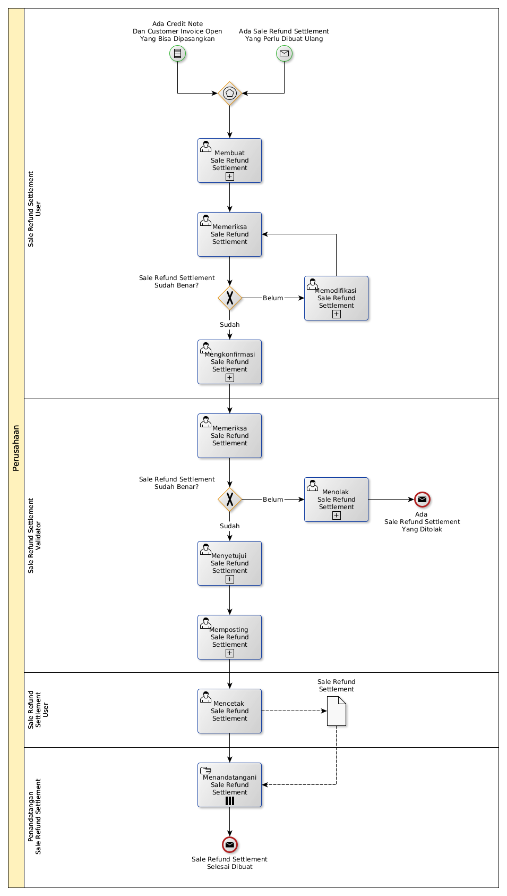

# Membuat Sale Refund Settlement

## <a name="input">A. START</a>

* *Message*: Ada sale refund settlement yang perlu dibuat ulang, atau
* *Condition*: Ada credit note dan customer invoice open yang bisa dipasangkan

## <a name="role">B. ROLE YANG TERLIBAT</a>

* Sale Refund Settlement User
* Sale Refund Settlement Validator
* Penandatangan Sale Refund Settlement

## <a name="instruksi">C. INSTRUKSI KERJA</a>

### C.1 Membuat Sale Refund Settlement

#### C.1.1 Instruksi Kerja Utama

[Odoo - Sale Refund Settlement: 3.1.4.2](../transaksi/sale-refund-settlement/membuat.md)

#### C.1.2 Sub Instruksi Kerja

* [Odoo - Sale Refund Settlement: 3.1.4.5](../transaksi/sale-refund-settlement/import-debit-line.md)
* [Odoo - Sale Refund Settlement: 3.1.4.6](../transaksi/sale-refund-settlement/memodifikasi-debit-line.md)
* [Odoo - Sale Refund Settlement: 3.1.4.7](../transaksi/sale-refund-settlement/menghapus-debit-line.md)
* [Odoo - Sale Refund Settlement: 3.1.4.8](../transaksi/sale-refund-settlement/import-credit-line.md)
* [Odoo - Sale Refund Settlement: 3.1.4.9](../transaksi/sale-refund-settlement/memodifikasi-credit-line.md)
* [Odoo - Sale Refund Settlement: 3.1.4.10](../transaksi/sale-refund-settlement/menghapus-credit-line.md)

### C.2 Mengkonfirmasi Sale Refund Settlement

#### C.2.1 Instruksi Kerja Utama

[Odoo - Sale Refund Settlement: 3.1.4.11](../transaksi/sale-refund-settlement/konfirmasi.md)

### C.3 Menyetujui Sale Refund Settlement

#### C.3.1 Instruksi Kerja Utama

[Odoo - Sale Refund Settlement: 3.1.4.12](../transaksi/sale-refund-settlement/approve.md)

### C.4 Memposting Sale Refund Settlement

#### C.4.1 Instruksi Kerja Utama

[Odoo - Sale Refund Settlement: 3.1.4.15](../transaksi/sale-refund-settlement/post.md)

## <a name="input">D. END</a>

*Message*: Sale Refund Settlement selesai dibuat
