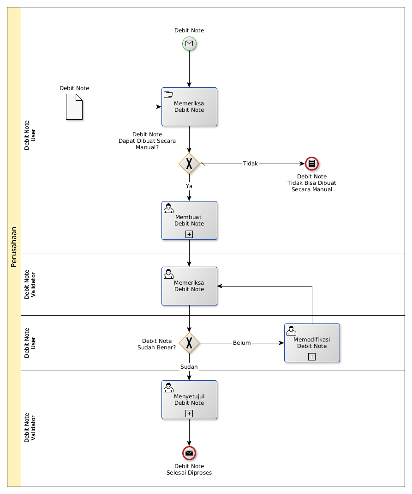

# Mencatat Nota Debit Secara Manual

## <a name="input">A. START</a>

*Message*: Ada Debit Note diterima

## <a name="role">B. ROLE YANG TERLIBAT</a>

* Debit Note User
* Debit Note Validator

## <a name="instruksi">C. INSTRUKSI KERJA</a>

### C.1. Membuat Debit Note

#### C.1.1 Instruksi Kerja Utama

[Odoo - Debit Note: 3.2.2.2](../transaksi/debit-note/membuat-manual.md)

#### C.1.2 Sub Instruksi Kerja

* [Odoo - Debit Note: 3.2.2.6](../transaksi/debit-note/membuat-manual-invoice-line.md)
* [Odoo - Debit Note: 3.2.2.7](../transaksi/debit-note/memodifikasi-invoice-line.md)
* [Odoo - Debit Note: 3.2.2.8](../transaksi/debit-note/menghapus-invoice-line.md)

### C.2. Menyetujui Debit Note

#### C.2.1 Instruksi Kerja Utama

[Odoo - Debit Note: 3.2.2.9](../transaksi/debit-note/approve.md)

## <a name="input">D. END</a>

*Message*: Debit Note selesai diproses
