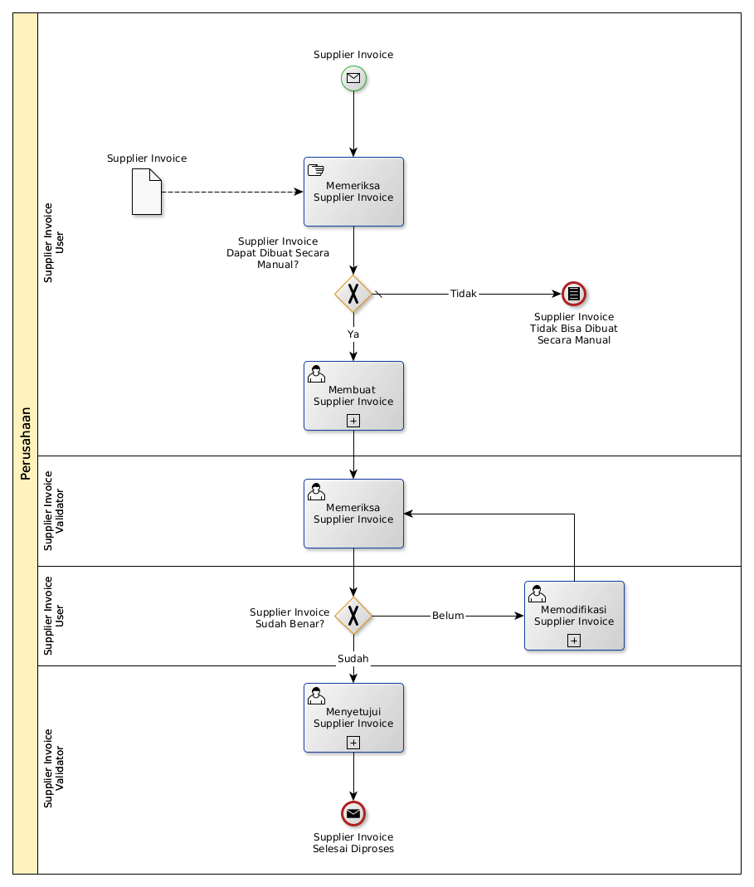

# Membuat Supplier Invoice Secara Manual

## <a name="input">A. START</a>

*Message*: Ada supplier invoice diterima

## <a name="role">B. ROLE YANG TERLIBAT</a>

* Supplier Invoice User
* Supplier Invoice Validator

## <a name="instruksi">C. INSTRUKSI KERJA</a>

### C.1. Membuat Supplier Invoice

#### C.1.1 Instruksi Kerja Utama

[Odoo - Supplier Invoice: 3.2.1.2](../transaksi/supplier-invoice/membuat-manual.md)

#### C.1.2 Sub Instruksi Kerja

* [Odoo - Supplier Invoice: 3.2.1.6](../transaksi/supplier-invoice/membuat-manual-invoice-line.md)
* [Odoo - Supplier Invoice: 3.2.1.7](../transaksi/supplier-invoice/modifikasi-invoice-line.md)
* [Odoo - Supplier Invoice: 3.2.1.8](../transaksi/supplier-invoice/menghapus-invoice-line.md)

### C.2. Menyetujui Supplier Invoice

#### C.2.1 Instruksi Kerja Utama

[Odoo - Supplier Invoice: 3.2.1.9](../transaksi/supplier-invoice/approve.md)

## <a name="input">D. END</a>

*Message*: Supplier Invoice selesai diproses
