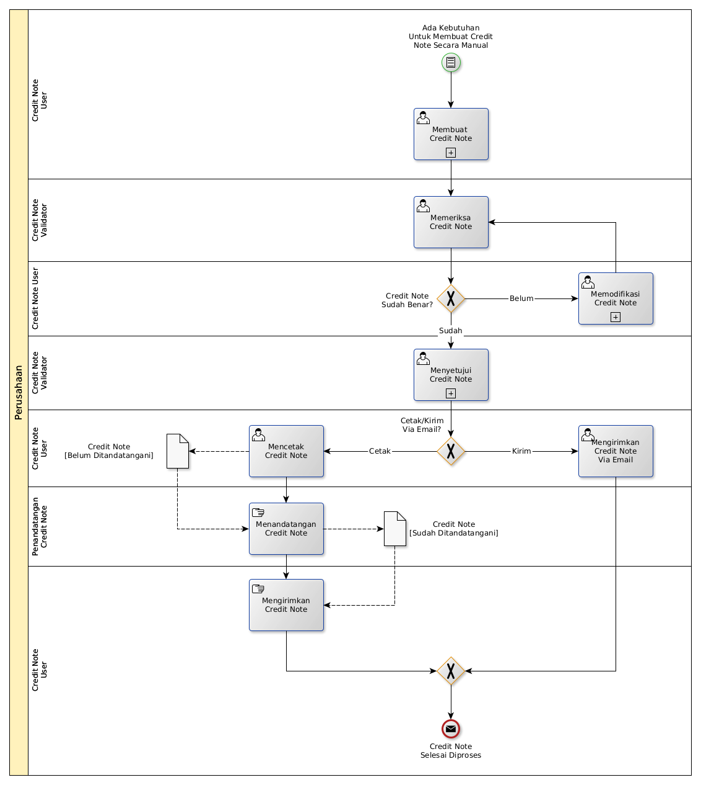

# Membuat Nota Kredit Secara Manual

## <a name="input">A. START</a>

* Condition: Ada kebutuhan untuk membuat credit note secara manual

## <a name="role">B. ROLE YANG TERLIBAT</a>

* Credit Note User
* Credit Note Validator
* Penandatangan Credit Note

## <a name="instruksi">C. INSTRUKSI KERJA</a>

### C.1. Membuat Credit Note

#### C.1.1 Instruksi Kerja Utama

[Odoo - Credit Note: 3.1.2.2](../transaksi/credit-note/membuat-manual.md)

#### C.1.2 Sub Instruksi Kerja

* [Odoo - Credit Note: 3.1.2.6](../transaksi/credit-note/membuat-manual-invoice-line.md)
* [Odoo - Credit Note: 3.1.2.7](../transaksi/credit-note/memodifikasi-invoice-line.md)
* [Odoo - Credit Note: 3.1.2.8](../transaksi/credit-note/menghapus-invoice-line.md)

### C.2. Menyetujui Credit Note

#### C.2.1 Instruksi Kerja Utama

[Odoo - Credit Note: 3.1.2.9](../transaksi/credit-note/approve.md)

## <a name="input">D. END</a>

*Message*: Credit Note selesai diproses
