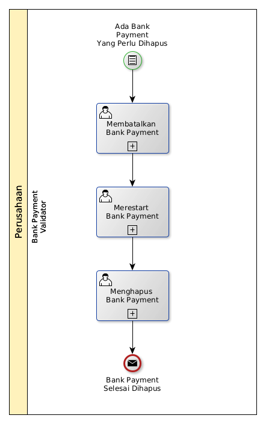

# Menghapus Bank Payment

## <a name="input">A. INPUT</a>

*Condition*: Ada bank payment yang perlu dihapus

## <a name="role">B. ROLE YANG TERLIBAT</a>

* Bank Payment Validator

## <a name="instruksi">C. INSTRUKSI KERJA</a>

### C.1 Membatalkan Bank Payment

#### C.1.1 Instruksi Kerja Utama

[Odoo - Bank Payment: 3.3.4.14](../transaksi/bank-payment/batal.md)

### C.2 Merestart Bank Payment

#### C.2.1 Instruksi Kerja Utama

[Odoo - Bank Payment: 3.3.4.16](../transaksi/bank-payment/restart.md)

### C.3 Menghapus Bank Payment

#### C.3.1 Instruksi Kerja Utama

[Odoo - Bank Payment: 3.3.4.4](../transaksi/bank-payment/menghapus.md)

## <a name="input">D. END</a>

*Message*: Bank Payment selesai dihapus.
