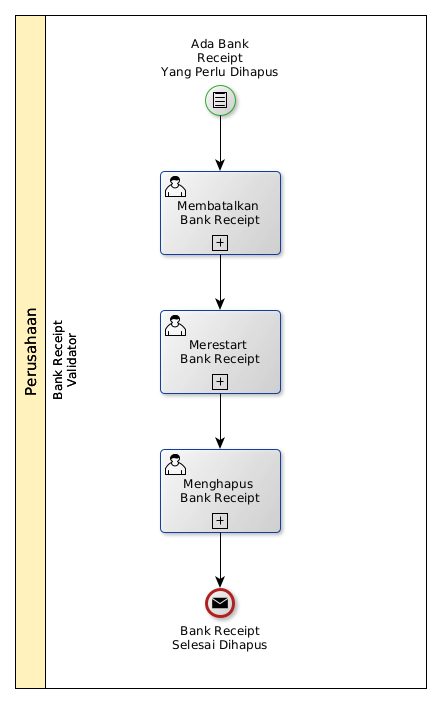

# Menghapus Bank Receipt

## <a name="input">A. INPUT</a>

*Condition*: Ada bank receipt yang perlu dihapus

## <a name="role">B. ROLE YANG TERLIBAT</a>

* Bank Receipt Validator

## <a name="instruksi">C. INSTRUKSI KERJA</a>

### C.1 Membatalkan Bank Receipt

#### C.1.1 Instruksi Kerja Utama

[Odoo - Bank Receipt: 3.3.3.14](../transaksi/bank-receipt/batal.md)

### C.2 Merestart Bank Receipt

#### C.2.1 Instruksi Kerja Utama

[Odoo - Bank Receipt: 3.3.3.16](../transaksi/bank-receipt/restart.md)

### C.3 Menghapus Bank Receipt

#### C.3.1 Instruksi Kerja Utama

[Odoo - Bank Receipt: 3.3.3.4](../transaksi/bank-receipt/menghapus.md)

## <a name="input">D. END</a>

*Message*: Credit Note selesai dihapus.
