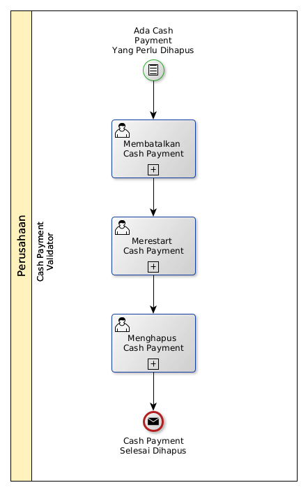

# Menghapus Cash Payment

## <a name="input">A. INPUT</a>

*Condition*: Ada cash payment yang perlu dihapus

## <a name="role">B. ROLE YANG TERLIBAT</a>

* Cash Payment Validator

## <a name="instruksi">C. INSTRUKSI KERJA</a>

### C.1 Membatalkan Cash Payment

#### C.1.1 Instruksi Kerja Utama

[Odoo - Cash Payment: 3.3.6.14](../transaksi/cash-payment/batal.md)

### C.2 Merestart Cash Payment

#### C.2.1 Instruksi Kerja Utama

[Odoo - Cash Payment: 3.3.6.16](../transaksi/cash-payment/restart.md)

### C.3 Menghapus Cash Payment

#### C.3.1 Instruksi Kerja Utama

[Odoo - Cash Payment: 3.3.6.4](../transaksi/cash-payment/menghapus.md)

## <a name="input">D. END</a>

*Message*: Cash Payment selesai dihapus.
