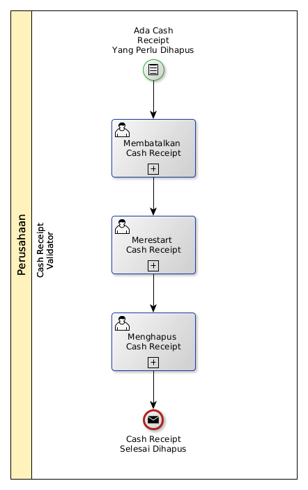

# Menghapus Cash Receipt

## <a name="input">A. INPUT</a>

*Condition*: Ada cash receipt yang perlu dihapus

## <a name="role">B. ROLE YANG TERLIBAT</a>

* Cash Receipt Validator

## <a name="instruksi">C. INSTRUKSI KERJA</a>

### C.1 Membatalkan Cash Receipt

#### C.1.1 Instruksi Kerja Utama

[Odoo - Cash Receipt: 3.3.5.14](../transaksi/cash-receipt/batal.md)

### C.2 Merestart Cash Receipt

#### C.2.1 Instruksi Kerja Utama

[Odoo - Cash Receipt: 3.3.5.16](../transaksi/cash-receipt/restart.md)

### C.3 Menghapus Cash Receipt

#### C.3.1 Instruksi Kerja Utama

[Odoo - Cash Receipt: 3.3.5.4](../transaksi/cash-receipt/menghapus.md)

## <a name="input">D. END</a>

*Message*: Cash Receipt selesai dihapus.
