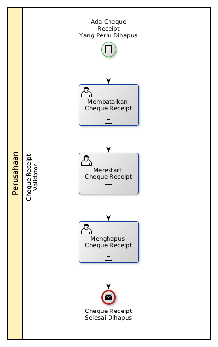

# Menghapus Cheque Receipt

## <a name="input">A. INPUT</a>

*Condition*: Ada cheque receipt yang perlu dihapus

## <a name="role">B. ROLE YANG TERLIBAT</a>

* Cheque Receipt Validator

## <a name="instruksi">C. INSTRUKSI KERJA</a>

### C.1 Membatalkan Cheque Receipt

#### C.1.1 Instruksi Kerja Utama

[Odoo - Cheque Receipt: 3.3.9.14](../transaksi/cheque-receipt/batal.md)

### C.2 Merestart Cheque Receipt

#### C.2.1 Instruksi Kerja Utama

[Odoo - Cheque Receipt: 3.3.9.16](../transaksi/cheque-receipt/restart.md)

### C.3 Menghapus Cheque Receipt

#### C.3.1 Instruksi Kerja Utama

[Odoo - Cheque Receipt: 3.3.9.4](../transaksi/cheque-receipt/menghapus.md)

## <a name="input">D. END</a>

*Message*: Cheque Receipt selesai dihapus.
