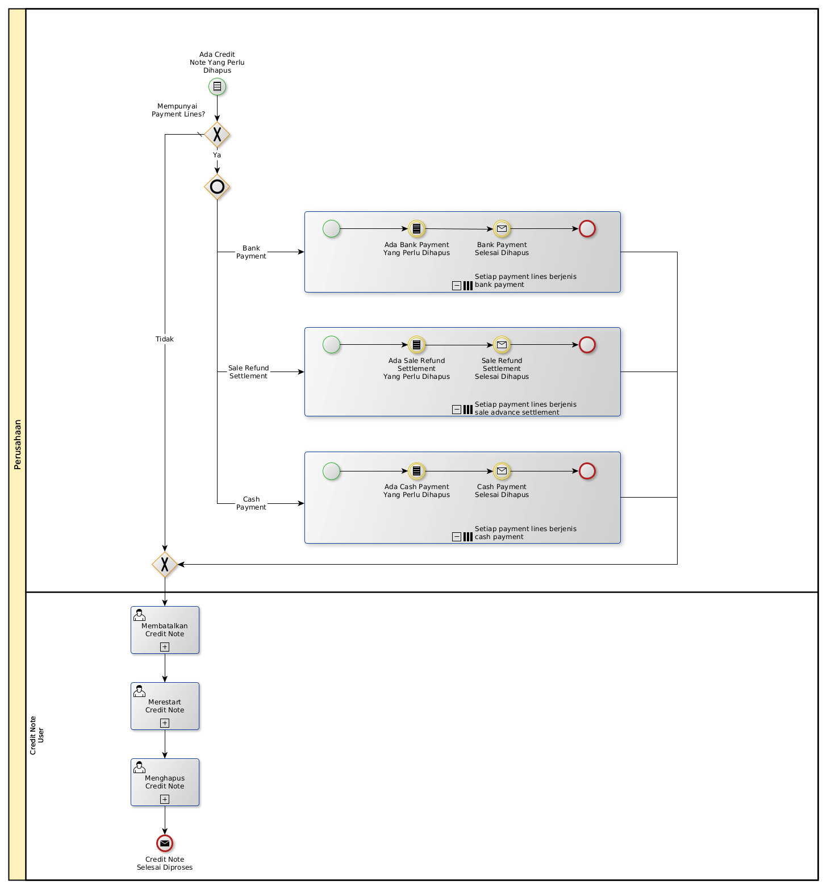

# Menghapus Nota Kredit

## <a name="input">A. INPUT</a>

*Condition*: Ada credit note yang perlu dihapus

## <a name="role">B. ROLE YANG TERLIBAT</a>

* Credit Note Validator

## <a name="instruksi">C. INSTRUKSI KERJA</a>

### C.1. Membatalkan Credit Note

#### C.1.1 Instruksi Kerja Utama

[Odoo - Credit Note: 3.1.2.11](../transaksi/credit-note/batal.md)

### C.2. Merestart Credit Note

#### C.2.1 Instruksi Kerja Utama

[Odoo - Credit Note: 3.1.2.13](../transaksi/credit-note/restart.md)

### C.3. Menghapus Credit Note

#### C.3.1 Instruksi Kerja Utama

[Odoo - Credit Note: 3.1.2.4](../transaksi/credit-note/menghapus.md)

## <a name="input">D. END</a>

*Message*: Credit Note selesai dihapus.
