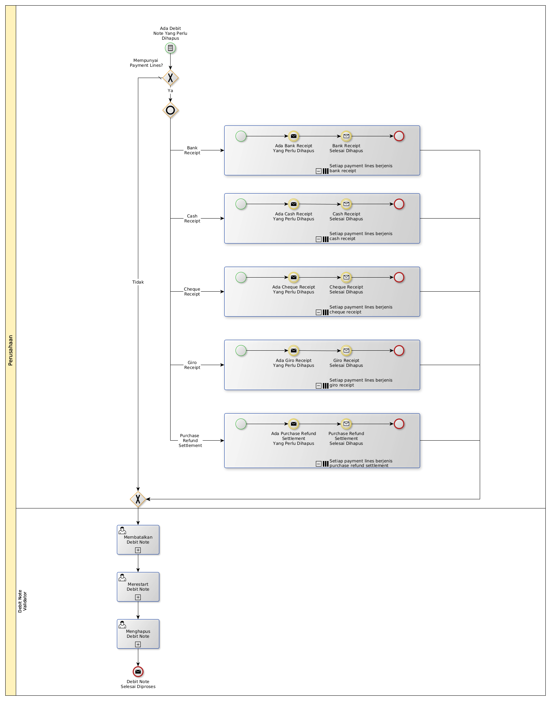

# Menghapus Nota Debit

## <a name="input">A. INPUT</a>

*Condition*: Ada debit note yang perlu dihapus

## <a name="role">B. ROLE YANG TERLIBAT</a>

* Debit Note User

## <a name="instruksi">C. INSTRUKSI KERJA</a>

### C.1. Membatalkan Debit Note

#### C.1.1 Instruksi Kerja Utama

[Odoo - Credit Note: 3.2.2.11](../transaksi/debit-note/batal.md)

### C.2. Merestart Debit Note

#### C.2.1 Instruksi Kerja Utama

[Odoo - Credit Note: 3.2.2.13](../transaksi/debit-note/restart.md)

### C.3. Menghapus Debit Note

#### C.3.1 Instruksi Kerja Utama

[Odoo - Credit Note: 3.2.2.4](../transaksi/debit-note/menghapus.md)

## <a name="input">D. END</a>

*Message*: Debit Note selesai diproses
