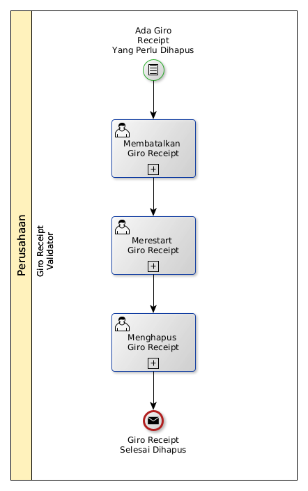

# Menghapus Giro Receipt

## <a name="input">A. INPUT</a>

*Condition*: Ada giro receipt yang perlu dihapus

## <a name="role">B. ROLE YANG TERLIBAT</a>

* Giro Receipt Validator

## <a name="instruksi">C. INSTRUKSI KERJA</a>

### C.1 Membatalkan Giro Receipt

#### C.1.1 Instruksi Kerja Utama

[Odoo - Giro Receipt: 3.3.7.14](../transaksi/giro-receipt/batal.md)

### C.2 Merestart Giro Receipt

#### C.2.1 Instruksi Kerja Utama

[Odoo - Giro Receipt: 3.3.7.16](../transaksi/giro-receipt/restart.md)

### C.3 Menghapus Giro Receipt

#### C.3.1 Instruksi Kerja Utama

[Odoo - Giro Receipt: 3.3.7.4](../transaksi/giro-receipt/menghapus.md)

## <a name="input">D. END</a>

*Message*: Giro Receipt selesai dihapus.
