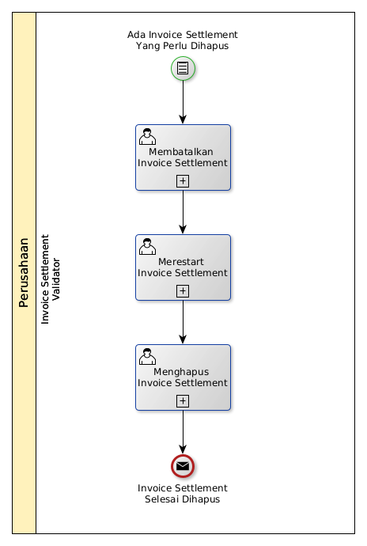

# Menghapus Invoice Settlement

## <a name="input">A. INPUT</a>

*Condition*: Ada invoice settlement yang perlu dihapus

## <a name="role">B. ROLE YANG TERLIBAT</a>

* Invoice Settlement Validator

## <a name="instruksi">C. INSTRUKSI KERJA</a>

### C.1 Membatalkan Invoice Settlement

#### C.1.1 Instruksi Kerja Utama

[Odoo - Invoice Settlement: 3.1.5.17](../transaksi/invoice-settlement/batal.md)

### C.2 Merestart Invoice Settlement

#### C.2.1 Instruksi Kerja Utama

[Odoo - Invoice Settlement: 3.1.5.18](../transaksi/invoice-settlement/restart.md)

### C.3 Menghapus Invoice Settlement

#### C.3.1 Instruksi Kerja Utama

[Odoo - Invoice Settlement: 3.1.5.4](../transaksi/invoice-settlement/menghapus.md)

## <a name="input">D. END</a>

*Message*: Invoice Settlement selesai dihapus.
