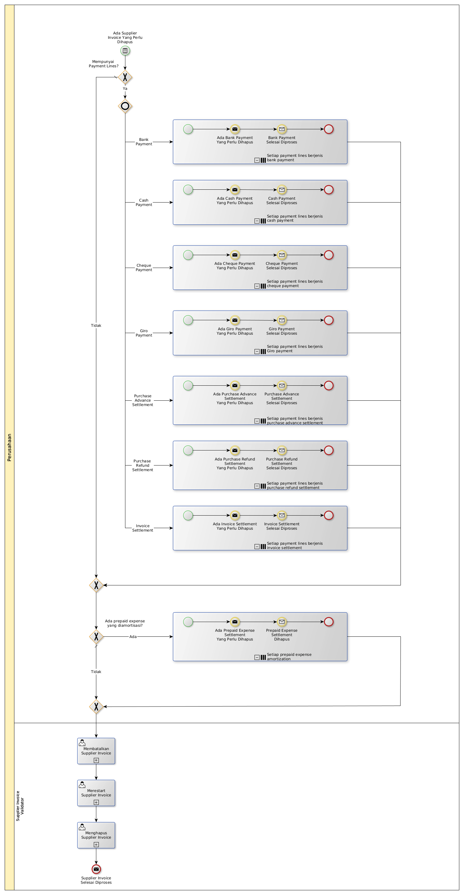

# Menghapus Supplier Invoice

## <a name="input">A. INPUT</a>

*Condition*: Ada supplier invoice yang perlu dihapus

## <a name="role">B. ROLE YANG TERLIBAT</a>

* Supplier Invoice User

## <a name="instruksi">C. INSTRUKSI KERJA</a>

### C.1. Membatalkan Supplier Invoice

#### C.1.1 Instruksi Kerja Utama

[Odoo - Supplier Invoice: 3.2.1.11](../transaksi/supplier-invoice/batal.md)

### C.2. Merestart Supplier Invoice

#### C.2.1 Instruksi Kerja Utama

[Odoo - Supplier Invoice: 3.2.1.13](../transaksi/supplier-invoice/restart.md)

### C.3. Menghapus Supplier Invoice

#### C.3.1 Instruksi Kerja Utama

[Odoo - Supplier Invoice: 3.2.1.4](../transaksi/supplier-invoice/menghapus.md)

## <a name="input">D. END</a>

*Message*: Supplier Invoice selesai diproses
