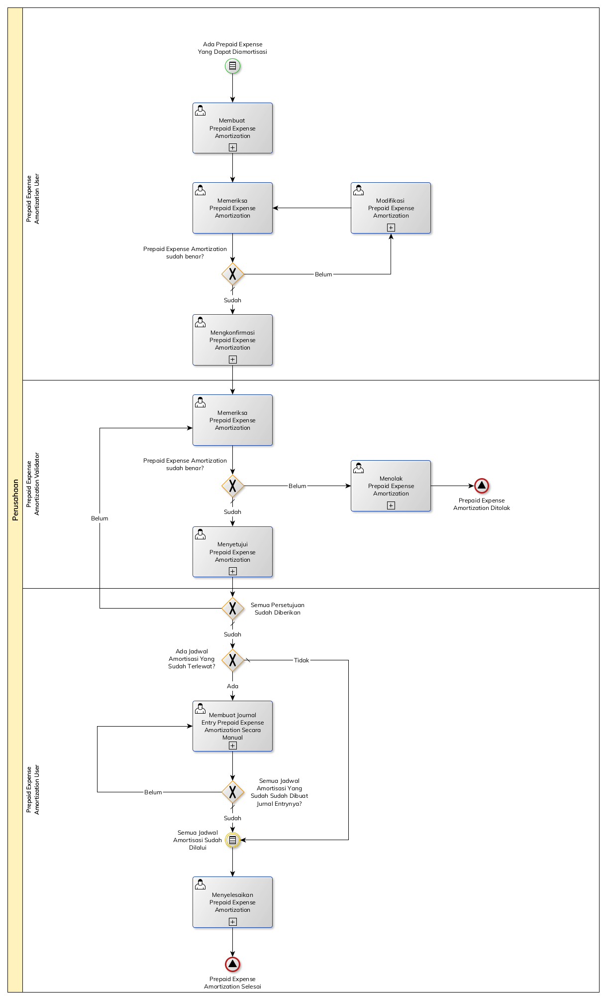

# Mengotomasi Amortisasi Prepaid Expense

## <a name="start">A. START</a>

*Condition*: Ada prepaid expense yang harus diamortisasi setiap bulannya

## <a name="role">B. ROLE YANG TERLIBAT</a>

* Prepaid Expense Amortization User
* Prepaid Expense Amortization Validator

## <a name="instruksi">C. INSTRUKSI KERJA</a>

## <a name="input">D. END</a>

*Message*: Prepaid Expense Amortization selesai
