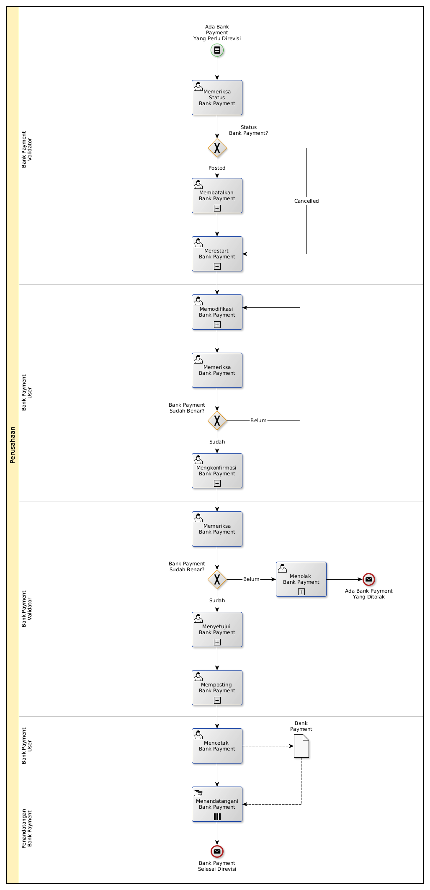

# Merevisi Bank Payment

## <a name="input">A. START</a>

*Condition*: Ada kebutuhan untuk merevisi Bank Payment

## <a name="role">B. ROLE YANG TERLIBAT</a>

* Bank Payment User
* Bank Payment Validator
* Penandatangan Bank Payment

## <a name="instruksi">C. INSTRUKSI KERJA</a>

### C.1 Membatalkan Bank Payment

#### C.1.1 Instruksi Kerja Utama

[Odoo - Bank Payment: 3.3.4.14](../transaksi/bank-payment/batal.md)

### C.2 Merestart Bank Payment

#### C.2.1 Instruksi Kerja Utama

[Odoo - Bank Payment: 3.3.4.16](../transaksi/bank-payment/restart.md)

### C.3 Memodifikasi Bank Payment

#### C.3.1 Instruksi Kerja Utama

[Odoo - Bank Payment: 3.3.4.3](../transaksi/bank-payment/modifikasi.md)

### C.4 Mengkonfirmasi Bank Payment

#### C.4.1 Instruksi Kerja Utama

[Odoo - Bank Payment: 3.3.4.9](../transaksi/bank-payment/konfirmasi.md)

### C.5 Menyetujui Bank Payment

#### C.5.1 Instruksi Kerja Utama

[Odoo - Bank Payment: 3.3.4.10](../transaksi/bank-payment/approve.md)

### C.6 Memposting Bank Payment

#### C.6.1 Instruksi Kerja Utama

[Odoo - Bank Payment: 3.3.4.13](../transaksi/bank-payment/post.md)

## <a name="input">D. END</a>

*Message*: Bank Payment selesai direvisi.
