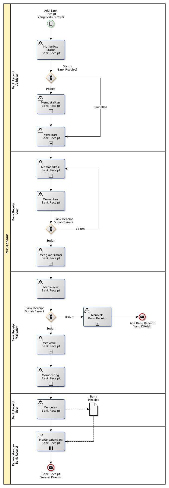

# Merevisi Bank Receipt

## <a name="input">A. START</a>

*Condition*: Ada kebutuhan untuk merevisi Bank Receipt

## <a name="role">B. ROLE YANG TERLIBAT</a>

* Bank Receipt User
* Bank Receipt Validator
* Penandatangan Bank Receipt

## <a name="instruksi">C. INSTRUKSI KERJA</a>

### C.1 Membatalkan Bank Receipt

#### C.1.1 Instruksi Kerja Utama

[Odoo - Bank Receipt: 3.3.3.14](../transaksi/bank-receipt/batal.md)

### C.2 Merestart Bank Receipt

#### C.2.1 Instruksi Kerja Utama

[Odoo - Bank Receipt: 3.3.3.16](../transaksi/bank-receipt/restart.md)

### C.3 Memodifikasi Bank Receipt

#### C.3.1 Instruksi Kerja Utama

[Odoo - Bank Receipt: 3.3.3.3](../transaksi/bank-receipt/memodifikasi.md)

### C.4 Mengkonfirmasi Bank Receipt

#### C.4.1 Instruksi Kerja Utama

[Odoo - Bank Receipt: 3.3.3.9](../transaksi/bank-receipt/konfirmasi.md)

### C.5 Menyetujui Bank Receipt

#### C.5.1 Instruksi Kerja Utama

[Odoo - Bank Receipt: 3.3.3.10](../transaksi/bank-receipt/approve.md)

### C.6 Memposting Bank Receipt

#### C.6.1 Instruksi Kerja Utama

[Odoo - Bank Receipt: 3.3.3.13](../transaksi/bank-receipt/post.md)

## <a name="input">D. END</a>

*Message*: Bank Receipt selesai direvisi.
