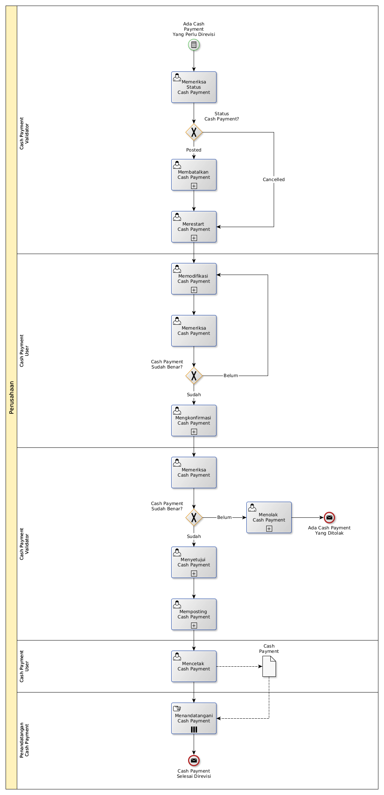

# Merevisi Cash Payment

## <a name="input">A. START</a>

*Condition*: Ada kebutuhan untuk merevisi Cash Payment

## <a name="role">B. ROLE YANG TERLIBAT</a>

* Cash Payment User
* Cash Payment Validator
* Penandatangan Cash Payment

## <a name="instruksi">C. INSTRUKSI KERJA</a>

### C.1 Membatalkan Cash Payment

#### C.1.1 Instruksi Kerja Utama

[Odoo - Cash Payment: 3.3.6.14](../transaksi/cash-payment/batal.md)

### C.2 Merestart Cash Payment

#### C.2.1 Instruksi Kerja Utama

[Odoo - Cash Payment: 3.3.6.16](../transaksi/cash-payment/restart.md)

### C.3 Memodifikasi Cash Payment

#### C.3.1 Instruksi Kerja Utama

[Odoo - Cash Payment: 3.3.6.3](../transaksi/cash-payment/memodifikasi.md)

### C.4 Mengkonfirmasi Cash Payment

#### C.4.1 Instruksi Kerja Utama

[Odoo - Cash Payment: 3.3.6.9](../transaksi/cash-payment/konfirmasi.md)

### C.5 Menyetujui Cash Payment

#### C.5.1 Instruksi Kerja Utama

[Odoo - Cash Payment: 3.3.6.10](../transaksi/cash-payment/approve.md)

### C.6 Memposting Cash Payment

#### C.6.1 Instruksi Kerja Utama

[Odoo - Cash Payment: 3.3.6.13](../transaksi/cash-payment/post.md)

## <a name="input">D. END</a>

*Message*: Cash Payment selesai direvisi.
