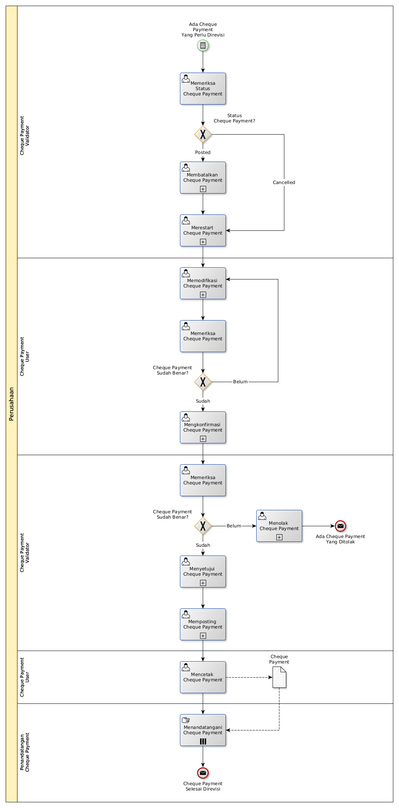

# Merevisi Cheque Payment

## <a name="input">A. START</a>

*Condition*: Ada kebutuhan untuk merevisi Cheque Payment

## <a name="role">B. ROLE YANG TERLIBAT</a>

* Cheque Payment User
* Cheque Payment Validator
* Penandatangan Cheque Payment

## <a name="instruksi">C. INSTRUKSI KERJA</a>

### C.1 Membatalkan Cheque Payment

#### C.1.1 Instruksi Kerja Utama

[Odoo - Cheque Payment: 3.3.10.14](../transaksi/cheque-payment/batal.md)

### C.2 Merestart Cheque Payment

#### C.2.1 Instruksi Kerja Utama

[Odoo - Cheque Payment: 3.3.10.16](../transaksi/cheque-payment/restart.md)

### C.3 Memodifikasi Cheque Payment

#### C.3.1 Instruksi Kerja Utama

[Odoo - Cheque Payment: 3.3.10.3](../transaksi/cheque-payment/memodifikasi.md)

### C.4 Mengkonfirmasi Cheque Payment

#### C.4.1 Instruksi Kerja Utama

[Odoo - Cheque Payment: 3.3.10.9](../transaksi/cheque-payment/konfirmasi.md)

### C.5 Menyetujui Cheque Payment

#### C.5.1 Instruksi Kerja Utama

[Odoo - Cheque Payment: 3.3.10.10](../transaksi/cheque-payment/approve.md)

### C.6 Memposting Cheque Payment

#### C.6.1 Instruksi Kerja Utama

[Odoo - Cheque Payment: 3.3.10.13](../transaksi/cheque-payment/post.md)

## <a name="input">D. END</a>

*Message*: Cheque Payment selesai direvisi.
