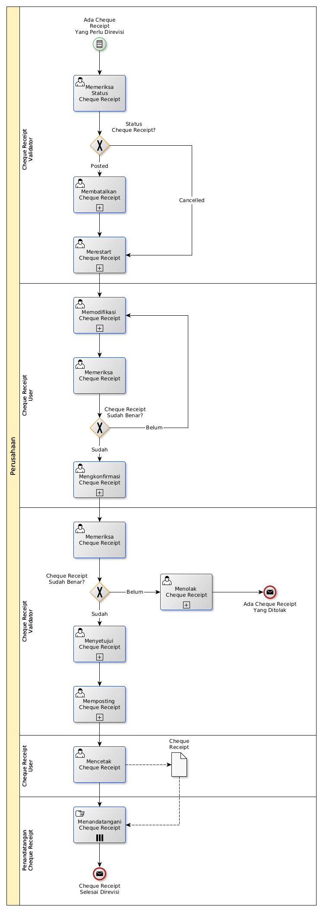

# Merevisi Cheque Receipt

## <a name="input">A. START</a>

*Condition*: Ada kebutuhan untuk merevisi Cheque Receipt

## <a name="role">B. ROLE YANG TERLIBAT</a>

* Cheque Receipt User
* Cheque Receipt Validator
* Penandatangan Cheque Receipt

## <a name="instruksi">C. INSTRUKSI KERJA</a>

### C.1 Membatalkan Cheque Receipt

#### C.1.1 Instruksi Kerja Utama

[Odoo - Cheque Receipt: 3.3.9.14](../transaksi/cheque-receipt/batal.md)

### C.2 Merestart Cheque Receipt

#### C.2.1 Instruksi Kerja Utama

[Odoo - Cheque Receipt: 3.3.9.16](../transaksi/cheque-receipt/restart.md)

### C.3 Memodifikasi Cheque Receipt

#### C.3.1 Instruksi Kerja Utama

[Odoo - Cheque Receipt: 3.3.9.3](../transaksi/cheque-receipt/memodifikasi.md)

### C.4 Mengkonfirmasi Cheque Receipt

#### C.4.1 Instruksi Kerja Utama

[Odoo - Cheque Receipt: 3.3.9.9](../transaksi/cheque-receipt/konfirmasi.md)

### C.5 Menyetujui Cheque Receipt

#### C.5.1 Instruksi Kerja Utama

[Odoo - Cheque Receipt: 3.3.9.10](../transaksi/cheque-receipt/approve.md)

### C.6 Memposting Cheque Receipt

#### C.6.1 Instruksi Kerja Utama

[Odoo - Cheque Receipt: 3.3.9.13](../transaksi/cheque-receipt/post.md)

## <a name="input">D. END</a>

*Message*: Cheque Receipt selesai direvisi.
