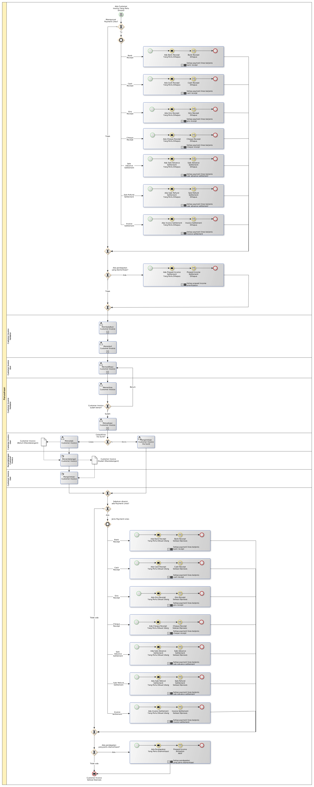

# Merevisi Customer Invoice

## <a name="input">A. INPUT</a>

*Condition*: Ada kebutuhan untuk merevisi customer invoice

## <a name="role">B. ROLE YANG TERLIBAT</a>

* Customer Invoice User
* Customer Invoice Validator
* Penandatangan Customer Invoice

## <a name="instruksi">C. INSTRUKSI KERJA</a>

### C.1. Membatalkan Customer Invoice

#### C.1.1 Instruksi Kerja Utama

[Odoo - Customer Invoice: 3.1.1.11](../transaksi/customer-invoice/batal.md)

### C.2. Merestart Customer Invoice

#### C.2.1 Instruksi Kerja Utama

[Odoo - Customer Invoice: 3.1.1.13](../transaksi/customer-invoice/restart.md)

### C.3. Memodifikasi Customer Invoice

#### C.3.1 Instruksi Kerja Utama

[Odoo - Customer Invoice: 3.1.1.3](../transaksi/customer-invoice/modifikasi.md)

#### C.3.2 Sub Instruksi Kerja

* [Odoo - Customer Invoice: 3.1.1.6](../transaksi/customer-invoice/membuat-manual-invoice-line.md)
* [Odoo - Customer Invoice: 3.1.1.7](../transaksi/customer-invoice/memodifikasi-manual-invoice-line.md)
* [Odoo - Customer Invoice: 3.1.1.8](../transaksi/customer-invoice/menghapus-manual-invoice-line.md)

### C.4. Menyetujui Customer Invoice

#### C.4.1 Instruksi Kerja Utama

[Odoo - Customer Invoice: 3.1.1.9](../transaksi/customer-invoice/approve.md)

## <a name="input">D. END</a>

*Message*: Customer Invoice selesai diproses
