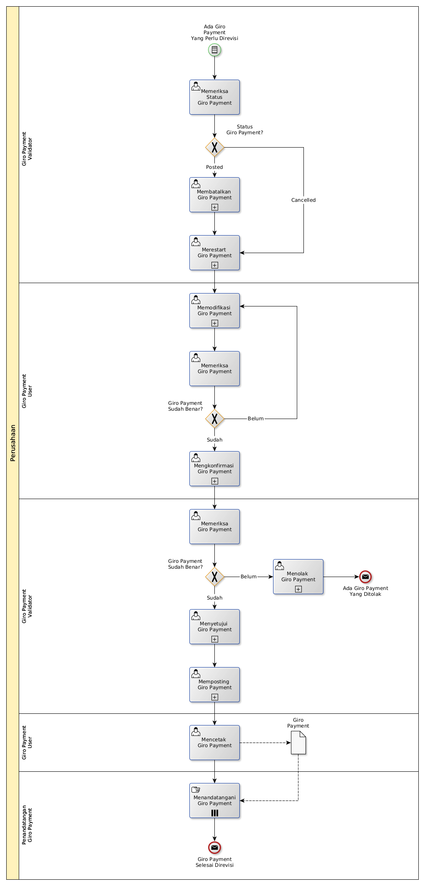

# Merevisi Giro Payment

## <a name="input">A. START</a>

*Condition*: Ada kebutuhan untuk merevisi Giro Payment

## <a name="role">B. ROLE YANG TERLIBAT</a>

* Giro Payment User
* Giro Payment Validator
* Penandatangan Giro Payment

## <a name="instruksi">C. INSTRUKSI KERJA</a>

### C.1 Membatalkan Giro Payment

#### C.1.1 Instruksi Kerja Utama

[Odoo - Giro Payment: 3.3.8.14](../transaksi/giro-payment/batal.md)

### C.2 Merestart Giro Payment

#### C.2.1 Instruksi Kerja Utama

[Odoo - Giro Payment: 3.3.8.16](../transaksi/giro-payment/restart.md)

### C.3 Memodifikasi Giro Payment

#### C.3.1 Instruksi Kerja Utama

[Odoo - Giro Payment: 3.3.8.3](../transaksi/giro-payment/memodifikasi.md)

### C.4 Mengkonfirmasi Giro Payment

#### C.4.1 Instruksi Kerja Utama

[Odoo - Giro Payment: 3.3.8.9](../transaksi/giro-payment/konfirmasi.md)

### C.5 Menyetujui Giro Payment

#### C.5.1 Instruksi Kerja Utama

[Odoo - Giro Payment: 3.3.8.10](../transaksi/giro-payment/approve.md)

### C.6 Memposting Giro Payment

#### C.6.1 Instruksi Kerja Utama

[Odoo - Giro Payment: 3.3.8.13](../transaksi/giro-payment/post.md)

## <a name="input">D. END</a>

*Message*: Giro Payment selesai direvisi.
