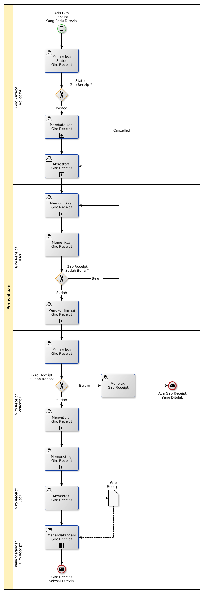

# Merevisi Giro Receipt

## <a name="input">A. START</a>

*Condition*: Ada kebutuhan untuk merevisi Giro Receipt

## <a name="role">B. ROLE YANG TERLIBAT</a>

* Giro Receipt User
* Giro Receipt Validator
* Penandatangan Giro Receipt

## <a name="instruksi">C. INSTRUKSI KERJA</a>

### C.1 Membatalkan Giro Receipt

#### C.1.1 Instruksi Kerja Utama

[Odoo - Giro Receipt: 3.3.7.14](../transaksi/giro-receipt/batal.md)

### C.2 Merestart Giro Receipt

#### C.2.1 Instruksi Kerja Utama

[Odoo - Giro Receipt: 3.3.7.16](../transaksi/giro-receipt/restart.md)

### C.3 Memodifikasi Giro Receipt

#### C.3.1 Instruksi Kerja Utama

[Odoo - Giro Receipt: 3.3.7.3](../transaksi/giro-receipt/memodifikasi.md)

### C.4 Mengkonfirmasi Giro Receipt

#### C.4.1 Instruksi Kerja Utama

[Odoo - Giro Receipt: 3.3.7.9](../transaksi/giro-receipt/konfirmasi.md)

### C.5 Menyetujui Giro Receipt

#### C.5.1 Instruksi Kerja Utama

[Odoo - Giro Receipt: 3.3.7.10](../transaksi/giro-receipt/approve.md)

### C.6 Memposting Giro Receipt

#### C.6.1 Instruksi Kerja Utama

[Odoo - Giro Receipt: 3.3.7.13](../transaksi/giro-receipt/post.md)

## <a name="input">D. END</a>

*Message*: Giro Receipt selesai direvisi.
