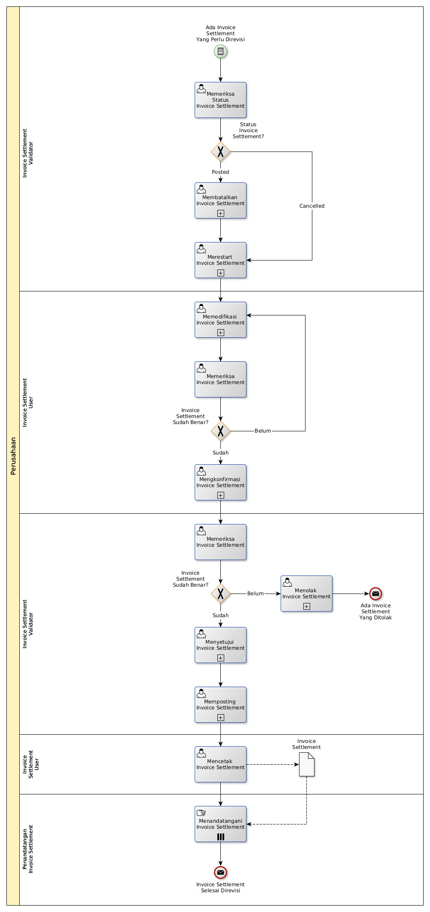

# Merevisi Invoice Settlement

## <a name="input">A. START</a>

*Condition*: Ada kebutuhan untuk merevisi Invoice Settlement

## <a name="role">B. ROLE YANG TERLIBAT</a>

* Invoice Settlement User
* Invoice Settlement Validator
* Penandatangan Invoice Settlement

## <a name="instruksi">C. INSTRUKSI KERJA</a>

### C.1 Membatalkan Invoice Settlement

#### C.1.1 Instruksi Kerja Utama

[Odoo - Invoice Settlement: 3.1.5.17](../transaksi/invoice-settlement/batal.md)

### C.2 Merestart Invoice Settlement

#### C.2.1 Instruksi Kerja Utama

[Odoo - Invoice Settlement: 3.1.5.18](../transaksi/invoice-settlement/restart.md)

### C.3 Memodifikasi Invoice Settlement

#### C.3.1 Instruksi Kerja Utama

[Odoo - Invoice Settlement: 3.1.5.3](../transaksi/invoice-settlement/memodifikasi.md)

### C.4 Mengkonfirmasi Invoice Settlement

#### C.4.1 Instruksi Kerja Utama

[Odoo - Invoice Settlement: 3.1.5.11](../transaksi/invoice-settlement/konfirmasi.md)

### C.5 Menyetujui Invoice Settlement

#### C.5.1 Instruksi Kerja Utama

[Odoo - Invoice Settlement: 3.1.5.12](../transaksi/invoice-settlement/approve.md)

### C.6 Memposting Invoice Settlement

#### C.6.1 Instruksi Kerja Utama

[Odoo - Invoice Settlement: 3.1.5.16](../transaksi/invoice-settlement/post.md)

## <a name="input">D. END</a>

*Message*: Invoice Settlement selesai direvisi.
