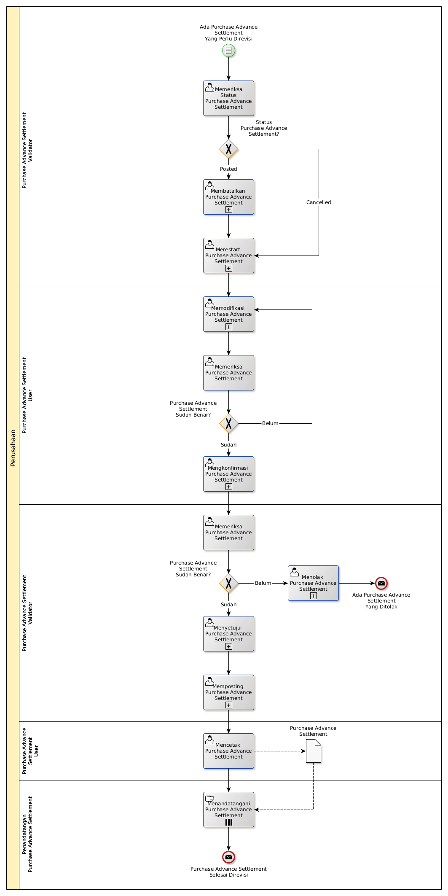

# Merevisi Purchase Advance Settlement

## <a name="input">A. START</a>

*Condition*: Ada kebutuhan untuk merevisi Purchase Advance Settlement

## <a name="role">B. ROLE YANG TERLIBAT</a>

* Purchase Advance Settlement User
* Purchase Advance Settlement Validator
* Penandatangan Purchase Advance Settlement

## <a name="instruksi">C. INSTRUKSI KERJA</a>

### C.1 Membatalkan Purchase Advance Settlement

#### C.1.1 Instruksi Kerja Utama

[Odoo - Purchase Advance Settlement: 3.2.3.16](../transaksi/purchase-advance-settlement/batal.md)

### C.2 Merestart Purchase Advance Settlement

#### C.2.1 Instruksi Kerja Utama

[Odoo - Purchase Advance Settlement: 3.2.3.18](../transaksi/purchase-advance-settlement/restart.md)

### C.3 Memodifikasi Purchase Advance Settlement

#### C.3.1 Instruksi Kerja Utama

[Odoo - Purchase Advance Settlement: 3.2.3.3](../transaksi/purchase-advance-settlement/memodifikasi.md)

### C.4 Mengkonfirmasi Purchase Advance Settlement

#### C.4.1 Instruksi Kerja Utama

[Odoo - Purchase Advance Settlement: 3.2.3.11](../transaksi/purchase-advance-settlement/konfirmasi.md)

### C.5 Menyetujui Purchase Advance Settlement

#### C.5.1 Instruksi Kerja Utama

[Odoo - Purchase Advance Settlement: 3.2.3.12](../transaksi/purchase-advance-settlement/approve.md)

### C.6 Memposting Purchase Advance Settlement

#### C.6.1 Instruksi Kerja Utama

[Odoo - Purchase Advance Settlement: 3.2.3.15](../transaksi/purchase-advance-settlement/post.md)

## <a name="input">D. END</a>

*Message*: Purchase Advance Settlement selesai direvisi.
