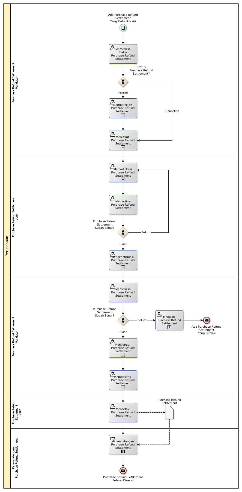

# Merevisi Purchase Refund Settlement

## <a name="input">A. START</a>

*Condition*: Ada kebutuhan untuk merevisi Purchase Refund Settlement

## <a name="role">B. ROLE YANG TERLIBAT</a>

* Purchase Refund Settlement User
* Purchase Refund Settlement Validator
* Penandatangan Purchase Refund Settlement

## <a name="instruksi">C. INSTRUKSI KERJA</a>

### C.1 Membatalkan Purchase Refund Settlement

#### C.1.1 Instruksi Kerja Utama

[Odoo - Purchase Refund Settlement: 3.2.4.16](../transaksi/purchase-refund-settlement/batal.md)

### C.2 Merestart Purchase Refund Settlement

#### C.2.1 Instruksi Kerja Utama

[Odoo - Purchase Refund Settlement: 3.2.4.18](../transaksi/purchase-refund-settlement/restart.md)

### C.3 Memodifikasi Purchase Refund Settlement

#### C.3.1 Instruksi Kerja Utama

[Odoo - Purchase Refund Settlement: 3.2.4.3](../transaksi/purchase-refund-settlement/memodifikasi.md)

### C.4 Mengkonfirmasi Purchase Refund Settlement

#### C.4.1 Instruksi Kerja Utama

[Odoo - Purchase Refund Settlement: 3.2.4.11](../transaksi/purchase-refund-settlement/konfirmasi.md)

### C.5 Menyetujui Purchase Refund Settlement

#### C.5.1 Instruksi Kerja Utama

[Odoo - Purchase Refund Settlement: 3.2.4.12](../transaksi/purchase-refund-settlement/approve.md)

### C.6 Memposting Purchase Refund Settlement

#### C.6.1 Instruksi Kerja Utama

[Odoo - Purchase Refund Settlement: 3.2.4.15](../transaksi/purchase-refund-settlement/post.md)

## <a name="input">D. END</a>

*Message*: Purchase Refund Settlement selesai direvisi.
