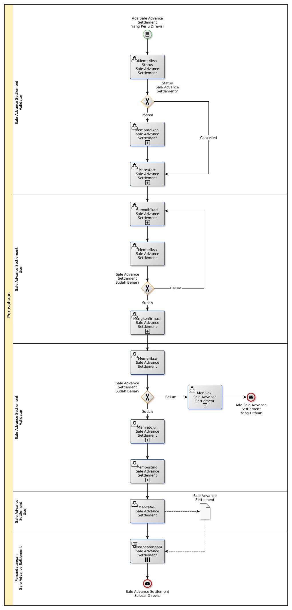

# Merevisi Sale Advance Settlement

## <a name="input">A. START</a>

*Condition*: Ada kebutuhan untuk merevisi Sale Advance Settlement

## <a name="role">B. ROLE YANG TERLIBAT</a>

* Sale Advance Settlement User
* Sale Advance Settlement Validator
* Penandatangan Sale Advance Settlement

## <a name="instruksi">C. INSTRUKSI KERJA</a>

### C.1 Membatalkan Sale Advance Settlement

#### C.1.1 Instruksi Kerja Utama

[Odoo - Sale Advance Settlement: 3.1.3.16](../transaksi/sale-advance-settlement/batal.md)

### C.2 Merestart Sale Advance Settlement

#### C.2.1 Instruksi Kerja Utama

[Odoo - Sale Advance Settlement: 3.1.3.18](../transaksi/sale-advance-settlement/restart.md)

### C.3 Memodifikasi Sale Advance Settlement

#### C.3.1 Instruksi Kerja Utama

[Odoo - Sale Advance Settlement: 3.1.3.3](../transaksi/sale-advance-settlement/memodifikasi.md)

### C.4 Mengkonfirmasi Sale Advance Settlement

#### C.4.1 Instruksi Kerja Utama

[Odoo - Sale Advance Settlement: 3.1.3.11](../transaksi/sale-advance-settlement/konfirmasi.md)

### C.5 Menyetujui Sale Advance Settlement

#### C.5.1 Instruksi Kerja Utama

[Odoo - Sale Advance Settlement: 3.1.3.12](../transaksi/sale-advance-settlement/approve.md)

### C.6 Memposting Sale Advance Settlement

#### C.6.1 Instruksi Kerja Utama

[Odoo - Sale Advance Settlement: 3.1.3.15](../transaksi/sale-advance-settlement/post.md)

## <a name="input">D. END</a>

*Message*: Sale Advance Settlement selesai direvisi.
