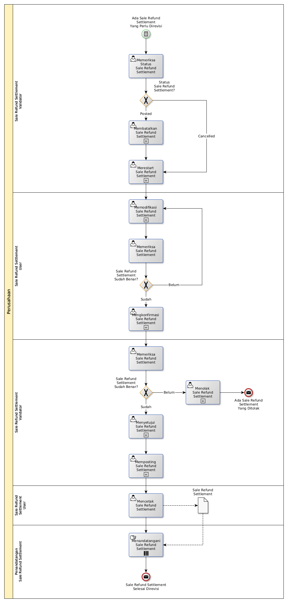

# Merevisi Sale Refund Settlement

## <a name="input">A. START</a>

*Condition*: Ada kebutuhan untuk merevisi Sale Refund Settlement

## <a name="role">B. ROLE YANG TERLIBAT</a>

* Sale Refund Settlement User
* Sale Refund Settlement Validator
* Penandatangan Sale Refund Settlement

## <a name="instruksi">C. INSTRUKSI KERJA</a>

### C.1 Membatalkan Sale Refund Settlement

#### C.1.1 Instruksi Kerja Utama

[Odoo - Sale Refund Settlement: 3.1.4.16](../transaksi/sale-refund-settlement/batal.md)

### C.2 Merestart Sale Refund Settlement

#### C.2.1 Instruksi Kerja Utama

[Odoo - Sale Refund Settlement: 3.1.4.18](../transaksi/sale-refund-settlement/restart.md)

### C.3 Memodifikasi Sale Refund Settlement

#### C.3.1 Instruksi Kerja Utama

[Odoo - Sale Refund Settlement: 3.1.4.3](../transaksi/sale-refund-settlement/memodifikasi.md)

### C.4 Mengkonfirmasi Sale Refund Settlement

#### C.4.1 Instruksi Kerja Utama

[Odoo - Sale Refund Settlement: 3.1.4.11](../transaksi/sale-refund-settlement/konfirmasi.md)

### C.5 Menyetujui Sale Refund Settlement

#### C.5.1 Instruksi Kerja Utama

[Odoo - Sale Refund Settlement: 3.1.4.12](../transaksi/sale-refund-settlement/approve.md)

### C.6 Memposting Sale Refund Settlement

#### C.6.1 Instruksi Kerja Utama

[Odoo - Sale Refund Settlement: 3.1.4.15](../transaksi/sale-refund-settlement/post.md)

## <a name="input">D. END</a>

*Message*: Sale Refund Settlement selesai direvisi.
