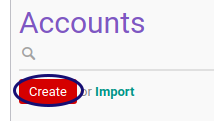

# Membuat Account

*(Tidak ada instruksi khusus)*

## B. LANGKAH KERJA

1. Buka menu **Accounting -> Configuration -> Accounts -> Account**
2. Klik tombol **Create** pada bagian atas-kiri form.

3. Isi **[Account Code](./penjelasan.md#field-code)**. Harus diisi.
4. Isi **[Account Name](./penjelasan.md#field-name)**. Harus diisi.
5. Pilih **[Parent](./penjelasan.md#field-parent-id)**. Tidak Harus diisi.
6. Pilih **[Internal Type](./penjelasan.md#field-type)**. Harus diisi.
7. Pilih **[Direct Cash FLow](./penjelasan.md#field-direct-cashflow-id)**. Tidak Harus diisi.
8. Pilih **[Indirect Cash FLow](./penjelasan.md#field-indirect-cashflow-id)**. Tidak Harus diisi.
9. Pilih **[Account Type](./penjelasan.md#field-account-type)**. Harus diisi.
10. Pilih **[Asset Category](./penjelasan.md#field-category-id)**. Tidak Harus diisi.
11. Centang **[Active](./penjelasan.md#field-active)** jika statusnya aktif.
12. Centang **[Centralized](./penjelasan.md#field-centralized)** jika akun akan dipusatkan jadi satu.
13. Pilih **[Default Operating Unit](./penjelasan.md#field-operating-unit-id)**. Tidak Harus diisi.
14. Pilih **[Default Taxes](./penjelasan.md#field-tax-ids)**. Tidak Harus diisi.
15. Centang **[Allow Reconciliation](./penjelasan.md#field-reconcile)** jika akun diperbolehkan untuk direkonsiliasi.
16. Pilih **[Secondary Currency](./penjelasan.md#field-currency-id)**. Tidak Harus diisi.
17. Pilih **[Outgoing Currency Rate](./penjelasan.md#field-currency-mode)**. Harus diisi jika secondary currency ada isian.
18. Isi **[Internal Note](./penjelasan.md#field-note)**. Tidak Harus diisi.
19. Klik tombol **Save** pada bagian atas-kiri form.

## C. OUTPUT

* Data *Account* akan tersimpan

## Chapter
- [Konfigurasi](../../konfigurasi.md)
- [Account](../account.md)
- [Penjelasan Account](penjelasan.md)
- [Memodifikasi Account](memodifikasi.md)
- [Menghapus Account](menghapus.md)
